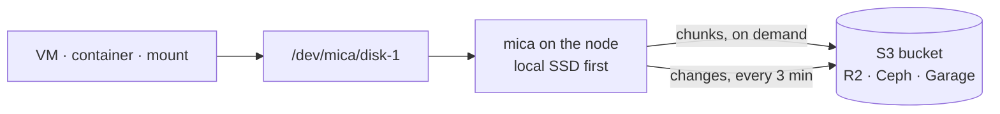
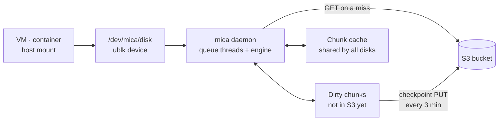
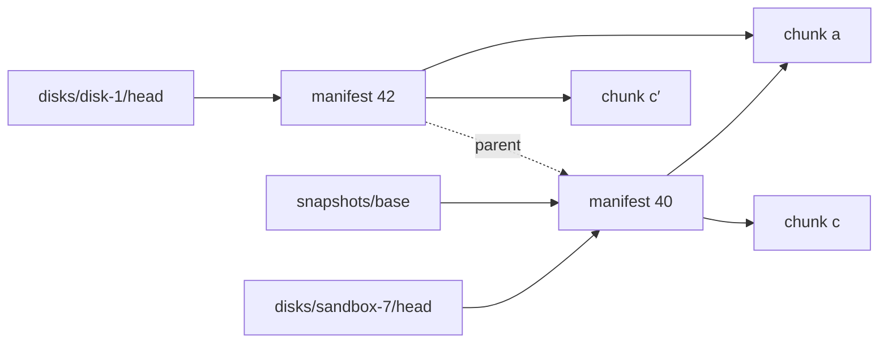
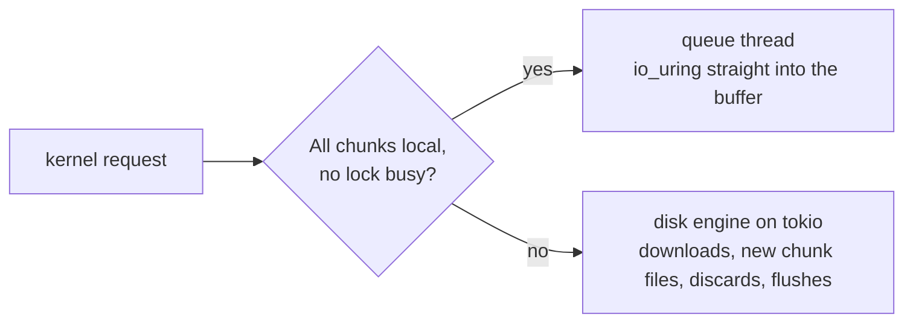
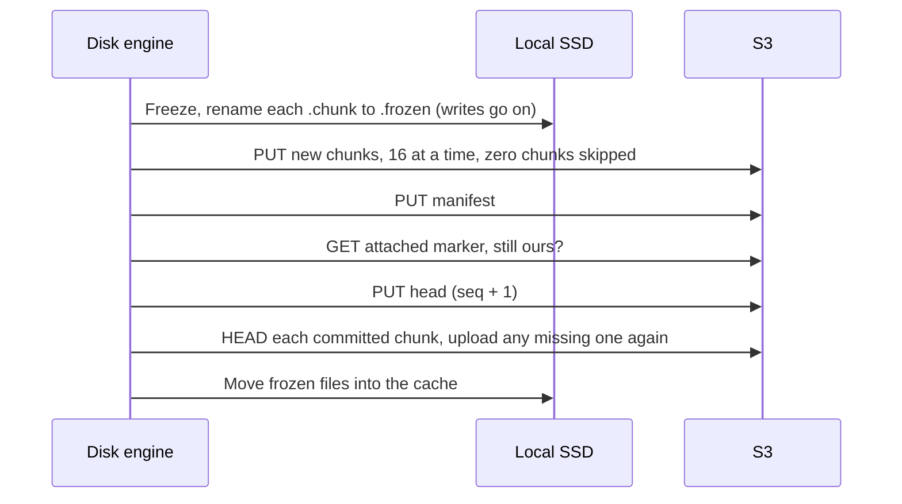
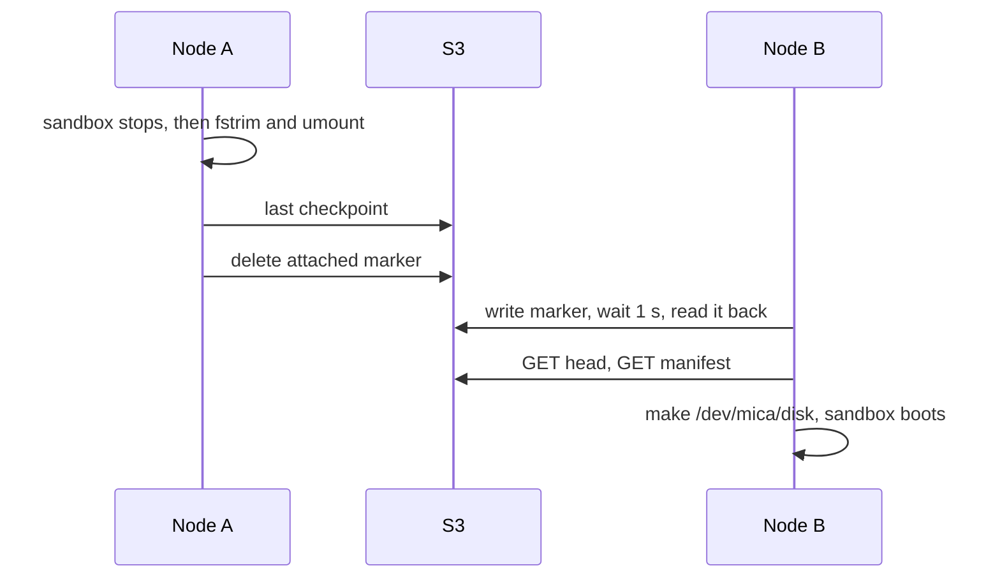
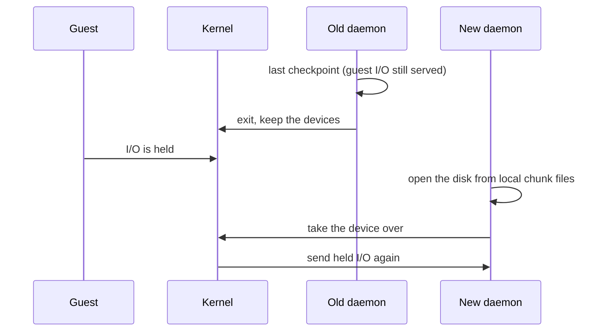

# mica

<p class="big" style="font-size:1.6em">Disks that follow your VMs and containers</p>

<p class="muted">A block device whose data lives in S3. How it works, how it stays safe, and what it costs.</p>

<p class="small muted">github.com/tanmoysrt/mica</p>

---

# The problem

A sandbox or lab VM runs on one machine, goes idle, and should start again on **any** machine.

<v-clicks>

- **Copying the disk first** is slow: a 20 GiB disk on a 100 Mbit link takes about half an hour.
- **Network block storage** (iSCSI, Ceph RBD) needs a storage cluster, and every read crosses the network.
- **Most of the disk is never read** after a move. A boot touches a few hundred MB.

</v-clicks>

<div v-click class="card" style="margin-top:1.2rem">
<p><strong>What we want:</strong> attach anywhere at once, read only what is used, write at local SSD speed.</p>
</div>

---
layout: center
---

# The idea



<p class="muted text-center">The bucket holds the durable copy. Each node uses its SSD for speed.</p>

---

# What you can do

<div class="cards three">
<div class="card">
<h3>Move sandboxes</h3>
<p>Stop an idle sandbox on one node and start it on another. The new node downloads only what the sandbox reads.</p>
</div>
<div class="card">
<h3>Boot labs fast</h3>
<p>Snapshot an image once. Every new disk from it copies no data, and a warm node boots it without downloads.</p>
</div>
<div class="card">
<h3>Plain volumes</h3>
<p>Mount a disk on a host or bind it into a container. Move it to another node later with the same files.</p>
</div>
</div>

<p class="muted" style="margin-top:1.5rem">It is a normal Linux block device. Anything that uses a disk can use it.</p>

---

# The big picture



<div class="cards three" style="margin-top:1rem">
<div class="card"><h3>Kernel</h3><p>ublk turns block requests into messages for mica. No kernel module of our own.</p></div>
<div class="card"><h3>Daemon</h3><p>One per node. Serves all attached disks, uploads, and holds the S3 client.</p></div>
<div class="card"><h3>Local SSD</h3><p>Dirty chunks S3 lacks, and a cache of clean chunks.</p></div>
</div>

---

# Three rules shape everything

<v-clicks>

1. **Writes go to the local SSD first.** The guest never waits for S3 on a write or a flush.
2. **Reads fetch from S3 only on a miss.** Nothing is copied when a disk attaches.
3. **A background checkpoint uploads changes** every 3 minutes. After a detach, S3 has everything.

</v-clicks>

<p v-click class="muted" style="margin-top:1.5rem">The rest of this deck is how those three rules stay fast and safe at the same time.</p>

---

# A disk is a list of 4 MiB chunks

A 100 GiB disk has 25,600 chunks. Chunk *N* always covers bytes `N × 4 MiB` to `(N+1) × 4 MiB`.

mica never sees files. The filesystem inside picks the byte offset; mica maps it with arithmetic:

```text
read 8 KiB at offset 1,073,745,920

chunk index     = 1,073,745,920 / 4,194,304 = 256
offset in chunk = 1,073,745,920 % 4,194,304 = 4,096
```

<v-click>

In S3, a chunk's key is the **SHA-256 of its content**:

```text
chunks/3f/3fa9c2…e71b      4 MiB, immutable, checked on every download
```

</v-click>

---

# Thin, and deduplicated for free

<div class="cards two">
<div class="card">
<h3>Zero chunks cost nothing</h3>
<p>An all-zero chunk is a marker, not an object. Reads return zeros from memory: no GET, no cache file, no upload. A new 20 GiB disk is one small manifest.</p>
</div>
<div class="card">
<h3>Equal chunks are stored once</h3>
<p>Same content, same hash, same object. An image and every disk made from it share chunks in S3 and in each node's cache.</p>
</div>
</div>

<p class="muted" style="margin-top:1.5rem">You pay only for data that was written, wherever on the disk it landed.</p>

---

# What is in S3

```text
chunks/<xx>/<chunk hash>       4 MiB of data, immutable
manifests/<manifest hash>      the chunk list of one disk at one moment, immutable
disks/<disk>/head              which manifest is current, overwritten on each commit
disks/<disk>/attached          which node owns the disk, only while attached
snapshots/<name>               a named manifest
gc/lock                        only while a GC runs
```

<v-clicks>

- **A manifest** lists every chunk: 32 bytes each, so 800 KiB for 100 GiB. One GET describes the full disk.
- **The head** is the only object a disk overwrites. One PUT switches the disk from one full state to the next.
- **No conditional writes** anywhere, so R2, Ceph and Garage behave the same.

</v-clicks>

---

# Manifests, snapshots and clones



<v-clicks>

- A **snapshot** is a pointer to a manifest. It copies no data.
- A **disk from a snapshot** points to the same manifest, and shares every chunk until it writes.
- Old manifests stay as **restore points** until GC.

</v-clicks>

---

# What is on the local SSD

```text
/var/lib/mica/
  node-id                      random ID of this node
  cache/<xx>/<chunk hash>      clean chunks; S3 has all of them
  disks/<disk>/
    state                      attached or orphaned, and the ublk device number
    dirty/<index>.chunk        a chunk the guest changed
    dirty/<index>.frozen       a chunk that a checkpoint uploads now
    dirty/<index>.tmp          a chunk being made; deleted after a crash
```

<v-clicks>

- **Dirty chunks** are the only data that S3 does not have. mica never deletes one before a commit includes it.
- **The cache** can lose any file at any time. It evicts the least recently used chunks at its limit.

</v-clicks>

---

# The read path

For each chunk a read touches, the first match wins:

<v-clicks>

1. A `.chunk` file: the guest's own recent write.
2. A `.frozen` file: a chunk that is uploading now.
3. A zero chunk: return zeros, nothing stored.
4. The local cache: a clean copy on the SSD.
5. S3: GET the chunk, check its SHA-256, save it in the cache.

</v-clicks>

<p v-click class="muted">When many requests miss the same chunk, mica sends one GET.</p>

---

# The write path

<v-clicks>

1. Lock the chunk.
2. If it has no `.chunk` file, make one from the current content: the frozen file, the cached chunk, or zeros. A write that covers the full chunk needs no copy.
3. Copy as `.tmp`, sync, rename to `.chunk`: a crash never leaves a half-copied chunk.
4. Write the data. Return to the guest without a sync.

</v-clicks>

<div v-click class="card" style="margin-top:1rem">
<p>On XFS and btrfs the copy is a reflink: no I/O. The lock stays held until the data is in the file, so a checkpoint cannot freeze a chunk mid-write.</p>
</div>

---

# Where a request runs



<v-clicks>

- Up to 4 queue threads per device, one per CPU.
- A cached 4K read takes about **10 µs**: no thread hop, no copy.
- Cache files stay open, so a hot read does not open a file.

</v-clicks>

---

# A flush never touches S3

The device reports a volatile write cache, so filesystems send FLUSH when they need durability.

<v-clicks>

- **FLUSH:** sync the changed chunk files at the same time, then the folder. Then return.
- **FUA write:** sync only the chunks it wrote.
- **A failed sync stops the disk.** Linux may drop unsynced pages after a failed `fsync`, so a retry that succeeds would prove nothing.

</v-clicks>

<p v-click class="muted">When a flush returns, the data survives a crash of mica or a reboot of the node.</p>

---

# The checkpoint



<p class="muted small">Every 3 minutes while dirty. An idle disk makes no requests.</p>

---

# Moving a disk between nodes



<p class="muted small">Chunks then come on demand. A 100 GiB disk attaches with two GETs. Unmount returns only when S3 has everything.</p>

---
layout: center
class: text-center
---

<p class="kicker">Part 2</p>

# Reliability

<p class="muted">What mica promises, and why the order of its steps keeps those promises.</p>

---

# Guarantees, stated honestly

<v-clicks>

1. **Flushed data survives** a crash of mica or a reboot of the node.
2. **While uploads keep up**, data older than about 5 minutes is in S3. On a slow link mica shows the disk as *behind*; `wait_when_behind` makes writes wait instead.
3. **After a detach**, S3 has all the data.
4. **Local data that S3 lacks is never deleted.**
5. **A second writer is detected, not prevented.** Without conditional writes no claim is fully exclusive; the controller must not attach one disk twice.
6. **Corrupt data is never served**: every download is checked against its hash.

</v-clicks>

---

# When something fails

| Failure | What happens | Data lost |
|---|---|---|
| mica restarts or crashes | Kernel holds the I/O; the new daemon takes the device over | None |
| Node reboots | At boot, mica uploads the local chunks | Unflushed writes |
| Node lost for good | Another node attaches with `--force` | About 5 min, more if *behind* |
| S3 down or slow | Writes continue to the SSD; checkpoints retry | None, while the node lives |
| Disk taken by another node | Old node sees it within a minute and stops | Its unsaved writes, kept locally |
| A local `fsync` fails | The disk stops and keeps its data | The guest sees an error |
| GC deletes a chunk mid-commit | The checkpoint uploads it again | None |

---

# Order is the safety

<div class="cards three">
<div class="card" v-click>
<h3>New local chunk</h3>
<p>Copy to <code>.tmp</code> → sync → rename. After a crash a <code>.chunk</code> is always complete.</p>
</div>
<div class="card" v-click>
<h3>Commit</h3>
<p>Chunks → manifest → marker check → head. Until the head PUT, the old head still describes a full disk.</p>
</div>
<div class="card" v-click>
<h3>Detach</h3>
<p>Last checkpoint → delete local chunks → release marker. A folder without chunks is always safe to delete.</p>
</div>
</div>

<p v-click class="muted" style="margin-top:1.3rem">No locks in S3 are needed: each step writes only what the next state can safely point to.</p>

---

# Fencing without conditional writes

Garage ignores `If-Match`, and Ceph support depends on the version. So mica relies on none.

<v-clicks>

1. **The controller** decides which node owns a disk.
2. **A claim reads back**: write the marker with a random ID, wait 1 s, read it. Two claims at once: the loser backs off.
3. **A watcher** reads the marker every minute, even on an idle disk.
4. **Full manifests** make the rest harmless: the head always points to one full disk, never a mix.

</v-clicks>

<p v-click class="muted">Tested: two nodes attached at the same moment and one won; a taken idle disk was noticed in 50 s.</p>

---

# Garbage collection without losing data

<div class="card">
<p><strong>The race:</strong> GC checks a chunk's age, then deletes it. A checkpoint can upload the same chunk in between, then commit a head that points to it.</p>
</div>

<v-clicks>

- **Repair after commit:** the checkpoint checks every committed chunk and uploads a missing one from its local copy.
- **24-hour grace:** GC deletes only old objects. A commit takes minutes.
- **The upload rule:** skip an upload only if the current manifest already has the chunk.
- **Stop on doubt:** if GC cannot read any root, it deletes nothing.

</v-clicks>

<p v-click class="muted small">Tested with a script that deleted every new chunk until the head moved: 14 chunks repaired, data read back from S3.</p>

---

# Restart without downtime



<p class="muted small">ublk user recovery. Tested: a writer ran through <code>mica service restart</code>: 150 files, no errors, longest pause 0.8 s.</p>

---
layout: center
class: text-center
---

<p class="kicker">Part 3</p>

# Numbers

<p class="muted">Measured on one laptop NVMe (btrfs) and Cloudflare R2 over a home link.</p>

---

# Local performance

4K and 1 MiB I/O with `O_DIRECT` in the guest filesystem.

| Test | Plain NVMe | mica |
|---|---|---|
| Sequential write 1 MiB | 836 MiB/s | 535 MiB/s |
| Random read 4K, depth 1 | 15k IOPS, 64 µs | **83k IOPS, 10 µs** |
| Random read 4K, depth 8 | 126k IOPS | **283k IOPS** |
| Sequential read, from cached chunks on SSD | 2008 MiB/s | 1603 MiB/s |
| Random write 4K, depth 1 | 28k IOPS | **52k IOPS** |
| Random write 4K, depth 8 | 112k IOPS | 67k IOPS |
| 4K write + `fdatasync` | 970/s | 917/s |

<p class="muted small">The test data is small, so hot chunks stay in the host page cache and warm reads beat the raw drive. With the page cache dropped, sequential reads from the SSD reach 80% of it. Parallel writes on the queue thread are still being tuned.</p>

---

# Cold boot: the network decides

An Ubuntu 24.04 boot in Firecracker from a cold cache touched **173 chunks = 692 MiB**.

| Download speed | Time for 692 MiB |
|---|---|
| 2.2 MB/s (the test link) | about 5.5 min |
| 50 MB/s (a server link) | about 14 s |
| 110 MB/s (1 Gbit) | about 6 s |

<v-clicks>

- **Warm node:** the root filesystem mounted at 0.8 s. No downloads.
- **Lesson 1:** keep base images warm on each node with `mica disk warm`.
- **Lesson 2:** 4 MiB chunks amplify scattered reads. Smaller chunks and read-ahead are next.

</v-clicks>

---

# What it costs on R2

<p class="muted small">Storage $0.015 per GB-month · PUT/LIST $4.50 per million · GET/HEAD $0.36 per million · egress free.</p>

| Action | Requests | Cost |
|---|---|---|
| Idle attached disk | none | $0 |
| Write 1 GiB of new data | 256 PUTs | $0.0012 |
| Stop and start a sandbox | ~6 PUTs, ~90 GETs | $0.00006 |
| A disk busy all day, every day | ~144k PUTs a month | ~$0.65 / month |
| 1 TB of stored data | – | ~$15 / month |

<p v-click class="muted">Storage dominates. Disks from one image share its chunks, so the image is stored once.</p>

---
layout: center
class: text-center
---

<p class="kicker">Part 4</p>

# Using it

---

# The CLI

```text
mica status                                   what is attached on this node
mica disk      ls | create | warm | attach | mount | unmount | detach | resize | delete
mica snapshot  ls | create | delete
mica gc                                       free data that nothing needs
mica cache     status | prune
mica service   setup | start | stop | restart | status | logs | …
```

```bash
mica disk create sandbox-7 --from-snapshot base-image
mica disk attach sandbox-7 --prefetch 32        # optional warm-up of the boot chunks
mica disk mount data-1 /srv/data --owner www-data
mica disk unmount data-1                         # returns when S3 has everything
```

---

# Running a node

<v-clicks>

- **`mica service setup`** asks for the bucket, tests put/get/delete, and installs `mica.service`. `--use-config-file` does it without questions.
- **Mounts are systemd units** (`mica-mount@<disk>`): they come back after a reboot, and upload before shutdown.
- **The `mica` group** uses mica without sudo. Mounts stay inside `/mnt`, `/srv`, `/media`, with `nosuid,nodev`; `--force` needs root.
- **Upgrades** are a restart: attached disks keep working.

</v-clicks>

---

# What is next

<v-clicks>

- **Read-ahead and guest-first downloads** for cold sequential reads, which today use one download at a time.
- **Smaller chunks** for boot disks, measured against the same Ubuntu image.
- **Parallel writes on the queue thread**: depth-8 writes fell from 195k to 67k IOPS; three variants are under test.
- **Automated tests** for the engine, checkpoints and crash recovery.
- **vhost-user-blk** as a second frontend for VMs, next to ublk.

</v-clicks>

---
layout: center
class: text-center
---


# mica

<p class="muted">Local SSD speed, S3 durability, disks that move.</p>

<p class="small">Code and docs: <a href="https://github.com/tanmoysrt/mica">github.com/tanmoysrt/mica</a></p>

<p class="small muted">Architecture · Reliability · Design · CLI · Operations in <code>docs/</code></p>
