<!-- _class: lead -->
<!-- _paginate: false -->

# Atlas HTTP proxy

How a site name reaches its VM

*DNS, OpenResty, a route map, and WG Mesh in one region*

---

# The browser knows a name. Atlas must find a VM.

- A browser asks for `erp.par-1.example.com`
- The site runs on a tenant VM, on one Metal host
- The VM can move to another host
- Proxy nodes can fail

*The proxy connects the name to the VM. It must keep working when a part of the cluster fails.*

---

<!-- _class: center -->

# Three questions, three answers


---

# A VM move changes no route

- Each VM has one private IPv6 address in the region: its **mesh address**
- A route maps a site name to a mesh address, such as `erp → fdaa:1:0:2::b`
- The mesh address stays the same when the VM moves to another host
- WG Mesh finds the new host

*So a route changes only when a site moves to another VM.*

---

# One node, two programs


*A region has 1 to 5 nodes. Each node is a service VM. OpenResty is the data plane. The control daemon is the control plane.*

---

<!-- _class: small -->

# Who owns what

| Part | Owns | Does not own |
|---|---|---|
| **Atlas app** | Proxy VMs, DNS, wildcard certificate, passwords, peer membership, Cargo routes | Tenant site routes |
| **Central** | Tenant site and custom-domain routes | Proxy nodes |
| **OpenResty** | Public traffic, from the local maps | Map changes |
| **Control daemon** | Route validation, saved snapshot, replication | Request forwarding |
| **WG Mesh** | Delivery to the VM's current host | Site names |

---

# Five parts

1. **One request:** how a site request reaches its VM
2. **Other names:** custom domains and auto-proxy names
3. **Route changes:** how the leader copies a change to every node
4. **Failures:** what still works, and what to retry
5. **Operation:** add a node, look at a node, find the code

---

<!-- header: '1 · One request' -->
<!-- _transition: fade 250ms -->

# DNS returns a proxy node



*`*.par-1.example.com` is a CNAME to `proxy.par-1.example.com`. Route 53 returns one A record for each healthy node.*

---

<!-- _transition: fade 250ms -->

# OpenResty ends TLS and reads its map



*One regional wildcard certificate covers every site name. The map lookup is in local memory.*

---

# WG Mesh carries HTTP to the VM



*The VM gets HTTP on port 80. WireGuard encrypts the packets between hosts.*

---

<!-- _class: center -->

# How OpenResty finds the site key


*Only a name exactly one label below the zone uses the site map. A site address of `-` returns `503`.*

---

# No cluster call on the request path

- OpenResty reads its own copy of the maps
- It does not ask the control daemon or other nodes
- So a node that loses its peers still serves all the routes that it knows

*Keep this property when you change the data plane. It is why a write outage is not a traffic outage.*

---

<!-- header: '2 · Other names' -->
<!-- _class: small -->

# Each kind of name has its own path

| Name | Example | TLS ends at | Route from |
|---|---|---|---|
| **Site** | `erp.par-1.example.com` | Proxy, wildcard certificate | Site map |
| **Custom domain** | `www.customer.com` | Site VM, its own certificate | Domain map, by SNI |
| **Auto-proxy** | `site-lpc8lqa.par-1.example.com` | Proxy, wildcard certificate | The name itself |
| **Control** | `proxy.par-1.example.com` | Proxy, wildcard certificate | Control daemon, `127.0.0.1:9000` |

*Plain HTTP on port 80 uses the same maps and goes to port 80 on the VM. The site API reserves `proxy` and `proxy-*`.*

---

# Custom domain: the proxy does not decrypt


*SNI (Server Name Indication) is the name in the TLS hello. The VM must accept PROXY protocol v2, a short header that gives it the real client address.*

---

# Custom domain edge cases

- A TLS connection with no SNI: OpenResty drops it
- An unknown custom domain: a placeholder certificate and an error page
- An HTTP-01 challenge for a custom domain goes to the VM on port 80
- A domain in the wildcard zone is refused by the domains API (`409`)

*HTTP and stream workers keep separate maps. The SNI bridge socket gives both the same state.*

---

# Why auto-proxy names exist

- A new VM needs a URL before anyone saves a site route
- The name carries the tenant and VM numbers
- OpenResty calculates the mesh address from the name
- No cluster write, no stored route

---

<!-- _class: center -->

# The name is the address


---

# Auto-proxy rules

- Only configured prefixes, such as `site-` or `*-vm-`
- A canonical lowercase label: at most 19 digits, no leading zero, at most 96 bits
- The control daemon reserves these names, so a site route cannot hide one
- The name gives identity, not location. WG Mesh still finds the host.

*A route is not access. Tenant and guest firewall rules still apply.*

---

<!-- header: '3 · Route changes' -->
<!-- _class: pause -->

# Route changes

Where the map comes from

---

<!-- _transition: fade 250ms -->

# Any node accepts, the follower forwards



*The nodes elect one leader. Only the leader orders changes. The forward timeout is 1500 ms.*

---

<!-- _transition: fade 250ms -->

# The leader applies, then sends to all peers



*The generation counts changes. Each peer request has a 200 ms timeout.*

---

# Enough acknowledgements, then success



*A later heartbeat makes the late node install the leader's snapshot.*

---

<!-- _class: small -->

# How many is enough

| Nodes | Acknowledgements for a write | Nodes that can be down |
|---:|---:|---:|
| 1 | 1 | 0 |
| 2 | 2 | 0 |
| 3 | 3 | 0 |
| 4 | 3 | 1 |
| 5 | 3 | 2 |

*The count includes the leader. Election and write use different counts: 3 nodes elect a leader with 2 votes, but a write needs all 3.*

---

# Leader election

- The leader sends a heartbeat every 100 ms
- A follower that hears nothing for 300 to 450 ms (random) starts an election
- A candidate needs a majority of votes
- Each voter compares the candidate's term and generation with its own

*A leader that sees a higher term in a heartbeat response becomes a follower.*

---

# Send a route change

```sh
curl -X PATCH \
  -H "Authorization: Bearer $TOKEN" \
  -H 'Content-Type: application/json' \
  -d '{"address":"fdaa:1:0:2::c"}' \
  https://proxy.par-1.example.com/v1/sites/erp
```

- `$TOKEN` is the regional proxy password or a signed JWT
- A JWT `scope` claim selects the maps, such as `site:*`. A `constraints` claim can limit the names.
- Success returns `X-Atlas-Proxy-Generation`

*The API reference is at `GET /docs` on each node.*

---

<!-- header: '4 · Failures' -->
<!-- _class: small -->

# Serving and changing need different things

| Situation | Live traffic | Route changes |
|---|---|---|
| **A node stops** | Other nodes serve. Route 53 stops returning it. | A new leader if needed. Writes need enough nodes. |
| **A node loses its peers** | It serves the routes in its local map. | It cannot confirm a write alone. |
| **A node returns** | It loads its saved map, then gets a newer snapshot. | It takes part after it catches up. |

*Serving needs one healthy node. Changing needs a leader and enough acknowledgements.*

---

<!-- _transition: fade 250ms -->

# A change reaches 2 of 3 nodes



*3 nodes need 3 acknowledgements. proxy-003 is down.*

---

<!-- _transition: fade 250ms -->

# The leader returns 503 and keeps the change



*There is no rollback. A `503` does not prove that the route stayed the same.*

---

# Send the same change again



*Every route change is safe to repeat. A replace sends the full map, an update sets one key, and a delete of an absent key succeeds.*

---

# A node that starts

1. Load `/var/lib/nginx/cluster-state.json` and apply it to OpenResty
2. Ask each configured peer for its status
3. Download the snapshot of the peer with the highest generation, if it is newer
4. `/readyz` returns `204` after the node syncs and knows a leader

*Atlas never sends route state to a node. The peers do.*

---

<!-- header: '5 · Operation' -->

# Atlas adds a node in six steps

1. Publish `proxy-NNN` DNS for the VM's public IPv4 address
2. Install the proxy package over root SSH
3. Send configuration, then update the membership of Active peers
4. Wait for `/readyz`
5. Create the `/healthz` check, then publish regional DNS
6. Mark the Proxy Server `Active`, then update Active nodes again

*A failed step sets the Failure field, such as `control-readiness`. Fix the cause, then select **Re-provision**.*

---

<!-- _class: small -->

# DNS names and health routes

| Name | Record | TTL |
|---|---|---:|
| `proxy-NNN.<zone>` | A record for one node: peers and health checks | 3600 s |
| `proxy.<zone>` | Multivalue A: one record for each healthy node | 120 s |
| `*.<zone>` | CNAME to `proxy.<zone>` | 3600 s |

| Route | Checks | Used by |
|---|---|---|
| `/healthz` | The node can serve traffic | Route 53, all the time |
| `/readyz` | Synced, knows a leader, OpenResty ready | Atlas, before DNS publication |

*`/healthz` ignores the leader. A node without a write quorum keeps its traffic.*

---

# Look at a node

```sh
sudo systemctl status openresty.service atlas-proxy-control.service
journalctl -u atlas-proxy-control.service -f

curl -H "Authorization: Bearer $TOKEN" \
  https://proxy-002.par-1.example.com/v1/cluster/status
```

- `cluster/status` gives the node ID, role, leader, term, generation, and readiness
- It needs a token with the `*` scope, or the proxy password

*Do not edit the files in `/var/lib/nginx` while the services run.*

---

<!-- _class: small -->

# Where the code lives

| Path | Holds |
|---|---|
| `services/http-proxy/nginx/lua/http/router.lua` | Site request routing |
| `services/http-proxy/nginx/lua/http/auto_proxy.lua` | Auto-proxy name decoding |
| `services/http-proxy/nginx/lua/stream/sni_router.lua` | Custom-domain TLS pass-through |
| `services/http-proxy/control/proxy_control/cluster.py` | Election, replication, recovery |
| `services/http-proxy/control/proxy_control/main.py` | Control API routes |
| `services/http-proxy/control/proxy_control/auth.py` | Passwords and tokens |
| `atlas/service/core/proxy/provisioning.py` | Node setup, readiness, DNS |

*Tests: `services/http-proxy/control/tests` and `services/http-proxy/tests`.*

---

<!-- header: '' -->
<!-- _class: lead -->
<!-- _paginate: false -->

# Read more

[HTTP proxy overview](https://github.com/frappe/atlas/blob/develop/docs/networking/http-proxy/index.md) · [OpenResty paths](https://github.com/frappe/atlas/blob/develop/docs/networking/http-proxy/openresty.md) · [High availability](https://github.com/frappe/atlas/blob/develop/docs/networking/http-proxy/high-availability.md)

[Control daemon](https://github.com/frappe/atlas/blob/develop/docs/networking/http-proxy/control-daemon.md) · [Provisioning](https://github.com/frappe/atlas/blob/develop/docs/networking/http-proxy/provisioning.md) · [WG Mesh deck](../atlas-wg-mesh/)

*frappe/atlas · all names and addresses are examples*
