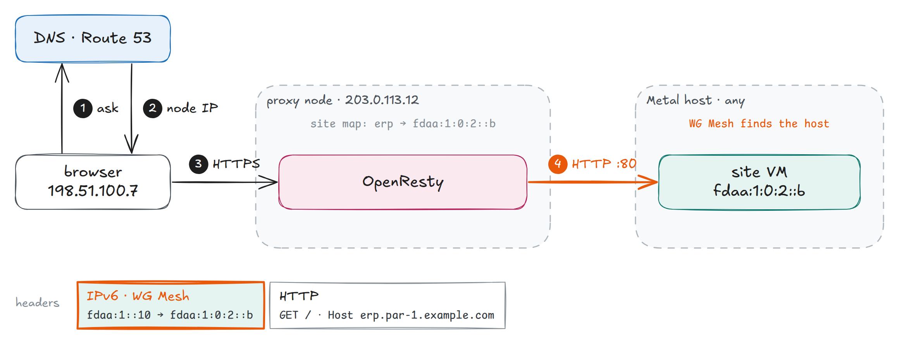
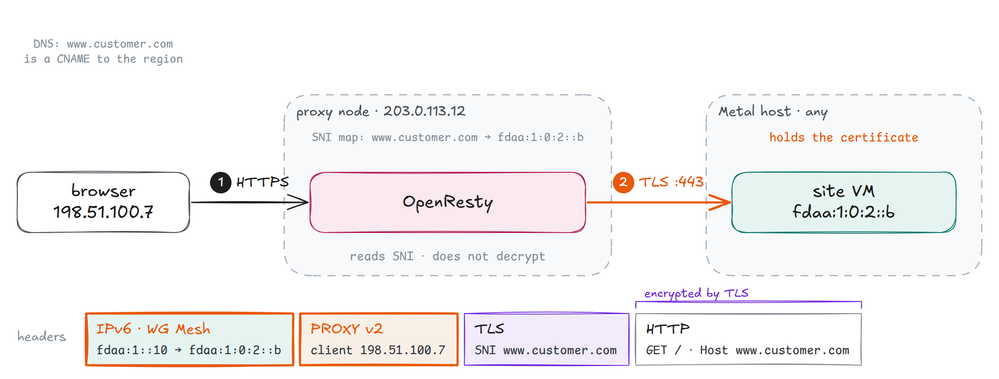
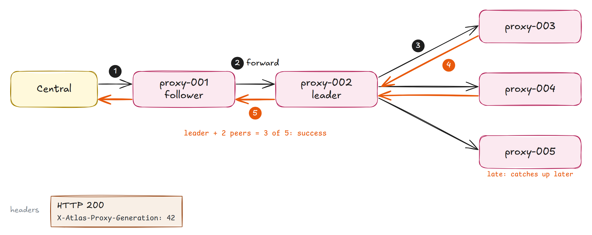
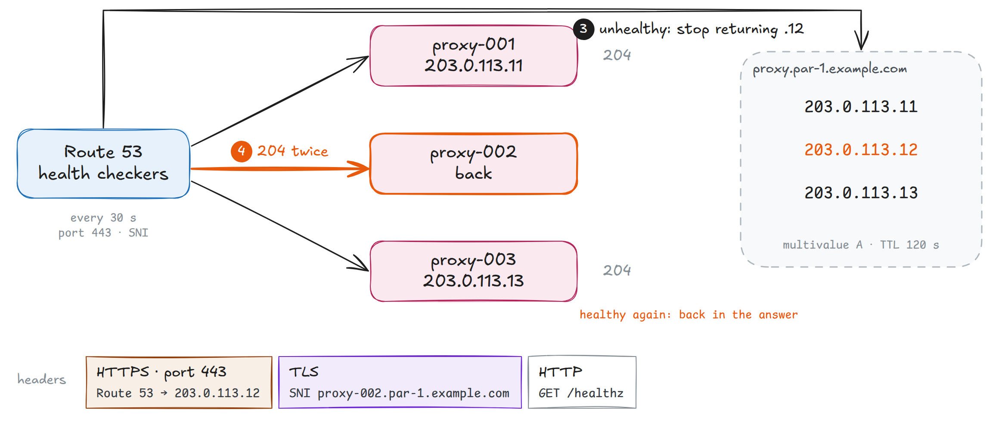
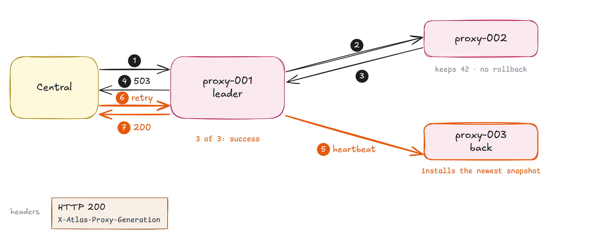

<!-- _class: lead -->
<!-- _paginate: false -->

# Atlas HTTP proxy

How a site name reaches its VM

*DNS, OpenResty, a route map, and WG Mesh in one region*

---

# The browser knows a name. Atlas must find a VM.

- The browser asks for `erp.par-1.example.com`
- The site runs on a tenant VM, on one Metal host
- The VM can move to another host
- A proxy node can fail

*The proxy must connect the name to the VM, even when a node fails.*

---

# Three questions, three answers


---

# A VM move changes no route

- Each VM has one private IPv6 address in the region: its **mesh address**
- A route maps a site to a mesh address: `erp → fdaa:1:0:2::b`
- A move keeps the mesh address. WG Mesh finds the new host.

*A route changes only when a site moves to another VM.*

---

# One node, two programs


*1 to 5 nodes per region · OpenResty: data plane · control daemon: control plane*

---

<!-- _class: small -->

# Who owns what

| Part | Owns | Does not own |
|---|---|---|
| **Atlas app** | Proxy VMs, DNS, health checks, wildcard certificate, passwords, peer membership, Cargo routes | Tenant site routes |
| **Central** | Tenant site and custom-domain routes | Proxy nodes |
| **OpenResty** | Public traffic, from the local maps | Map changes |
| **Control daemon** | Route validation, saved snapshot, replication | Request forwarding |
| **WG Mesh** | Delivery to the VM's current host | Site names |

---

# Five parts

1. **One request:** how a site request reaches its VM
2. **Other names:** custom domains and auto-proxy names
3. **Route changes:** how the leader copies a change to every node
4. **Failures:** health checks, partial writes, and recovery
5. **Operation:** add a node, look at a node, find the code

---

<!-- header: '1 · One request' -->

# One request, from name to VM

<div class="motion">
<video src="assets/request.mp4" poster="assets/request.png" autoplay loop muted playsinline aria-label="The browser asks Route 53 for erp.par-1.example.com and gets the IPv4 address of one healthy proxy node. It sends HTTPS to that node. OpenResty ends TLS with the wildcard certificate and reads erp in its local site map: fdaa:1:0:2::b. OpenResty sends plain HTTP to port 80 on that address, and WG Mesh carries it to the Metal host that runs the VM."></video>

</div>

*DNS picks the node · the map picks the VM · WG Mesh picks the host*

---

# How OpenResty finds the site key


*Only one label below the zone · a site address of `-` returns `503`*

---

# No cluster call on the request path

- OpenResty reads its own copy of the maps
- It does not ask the control daemon or other nodes
- A node that loses its peers still serves every route it knows

*Keep this when you change the data plane. A write outage is not a traffic outage.*

---

<!-- header: '2 · Other names' -->
<!-- _class: small -->

# Each kind of name has its own path

| Name | Example | TLS ends at | Route from |
|---|---|---|---|
| **Site** | `erp.par-1.example.com` | Proxy, wildcard certificate | Site map |
| **Custom domain** | `www.customer.com` | Site VM, its own certificate | Domain map, by SNI |
| **Auto-proxy** | `site-lpc8lqa.par-1.example.com` | Proxy, wildcard certificate | The name itself |
| **Control** | `proxy.par-1.example.com` | Proxy, wildcard certificate | Control daemon, `127.0.0.1:9000` |

*Plain HTTP on port 80 uses the same maps. The site API reserves `proxy` and `proxy-*`.*

---

# Custom domain: the proxy does not decrypt

<div class="motion">
<video src="assets/custom-domain.mp4" poster="assets/custom-domain.png" autoplay loop muted playsinline aria-label="The browser sends HTTPS for www.customer.com to a proxy node. OpenResty reads only the SNI name and finds the VM in its SNI map. It sends the unchanged TLS stream to port 443 on the VM, after a PROXY protocol v2 header with the client address. The VM holds the certificate."></video>

</div>

*SNI: the name in the TLS hello · no SNI: dropped · unknown domain: placeholder certificate and error page*

---

# Auto-proxy: the name is the address


*A new VM gets a URL before any route exists · no cluster write*

---

# Auto-proxy rules

- Configured prefixes only, such as `site-` or `*-vm-`
- Canonical lowercase label: 19 digits or fewer, no leading zero, 96 bits or fewer
- The control daemon reserves these names. A site route cannot hide one.
- The name gives identity, not location. WG Mesh still finds the host.

*A route is not access. Tenant and guest firewall rules still apply.*

---

<!-- header: '3 · Route changes' -->
<!-- _class: pause -->

# Route changes

Where the map comes from

---

# One change, from Central to every node

<div class="motion">
<video src="assets/write.mp4" poster="assets/write.png" autoplay loop muted playsinline aria-label="Central sends PATCH /v1/sites/erp to proxy-001, a follower, which forwards it to proxy-002, the leader. The leader applies the change, moves the generation from 41 to 42, and sends it to proxy-003, proxy-004, and proxy-005 at the same time. proxy-003 and proxy-004 acknowledge. With the leader that is 3 of 5, so the leader returns 200 through the follower. proxy-005 is late and catches up later."></video>

</div>

*Any ready node accepts · only the leader orders · forward 1500 ms · peer request 200 ms*

---

<!-- _class: small -->

# How many is enough

| Nodes | Acknowledgements for a write | Nodes that can be down |
|---:|---:|---:|
| 1 | 1 | 0 |
| 2 | 2 | 0 |
| 3 | 3 | 0 |
| 4 | 3 | 1 |
| 5 | 3 | 2 |

*The count includes the leader. 3 nodes elect with 2 votes, but a write needs all 3.*

---

# Leader election

- The leader sends a heartbeat every 100 ms
- No heartbeat for 300 to 450 ms (random): a follower starts an election
- A candidate needs a majority of votes
- Each voter compares the candidate's term and generation with its own

*A leader that sees a higher term becomes a follower.*

---

# Send a route change

```sh
curl -X PATCH \
  -H "Authorization: Bearer $TOKEN" \
  -H 'Content-Type: application/json' \
  -d '{"address":"fdaa:1:0:2::c"}' \
  https://proxy.par-1.example.com/v1/sites/erp
```

- `$TOKEN`: the regional proxy password, or a signed JWT
- JWT `scope` selects the maps, such as `site:*`. `constraints` can limit the names.
- Success returns `X-Atlas-Proxy-Generation`

*API reference: `GET /docs` on each node*

---

<!-- header: '4 · Failures' -->
<!-- _class: small -->

# Serving and changing need different things

| Situation | Live traffic | Route changes |
|---|---|---|
| **A node stops** | Other nodes serve. Route 53 stops returning it. | A new leader if needed. Writes need enough nodes. |
| **A node loses its peers** | It serves the routes in its local map. | It cannot confirm a write alone. |
| **A node returns** | It loads its saved map, then gets a newer snapshot. | It takes part after it catches up. |

*Serving needs one healthy node. Changing needs a leader and enough acknowledgements.*

---

# How Route 53 stops sending traffic to a failed node

<div class="motion">
<video src="assets/health.mp4" poster="assets/health.png" autoplay loop muted playsinline aria-label="Route 53 health checkers send HTTPS GET /healthz to each proxy node every 30 seconds, and each node answers 204. proxy-002 stops answering. After 2 failed checks, Route 53 marks it unhealthy and stops returning 203.0.113.12 in the answer for proxy.par-1.example.com. Resolvers can keep the old answer for up to 120 seconds. When proxy-002 passes 2 checks again, Route 53 puts its address back."></video>

</div>

*Atlas creates one health check per node · `proxy.<zone>` has one multivalue A record per node*

---

<!-- _class: small -->

# What `/healthz` checks

| Check | Catches |
|---|---|
| The control daemon has loaded its state | A daemon that is still starting |
| OpenResty answers on its admin socket | OpenResty is down |
| OpenResty holds the routes of the saved snapshot | OpenResty restarted with empty maps |
| **Not checked:** the leader | A node without a write quorum keeps its traffic |

- Through OpenResty on port 443: it also tests TLS and the certificate
- Detect: about 60 s (2 checks × 30 s) · cached answers: up to 120 s more
- All nodes unhealthy: Route 53 returns all records

---

# A 503 can still change a route

<div class="motion">
<video src="assets/partial.mp4" poster="assets/partial.png" autoplay loop muted playsinline aria-label="A 3-node region with proxy-003 down. Central sends a route change to proxy-001, the leader. The leader and proxy-002 apply generation 42, but proxy-003 does not answer. proxy-002 acknowledges, but 2 of 3 is not enough, so the leader returns 503 and keeps the change. proxy-003 comes back, and a leader heartbeat makes it install the newest snapshot. Central sends the same change again, and the leader returns 200."></video>

</div>

*No rollback · a `503` does not prove the route stayed the same · every change is safe to repeat*

---

# A node that starts

1. Load `/var/lib/nginx/cluster-state.json` and apply it to OpenResty
2. Ask each configured peer for its status
3. Download the snapshot of the peer with the highest generation, if it is newer
4. `/readyz` returns `204` after the node syncs and knows a leader

*Atlas never sends route state to a node. The peers do.*

---

<!-- header: '5 · Operation' -->

# Atlas adds a node in six steps

1. Publish `proxy-NNN` DNS for the VM's public IPv4 address
2. Install the proxy package over root SSH
3. Send configuration, then update the membership of Active peers
4. Wait for `/readyz`
5. Create the `/healthz` check, then publish regional DNS
6. Mark the Proxy Server `Active`, then update Active nodes again

*A failed step sets the Failure field, such as `control-readiness`. Fix the cause, then select **Re-provision**.*

---

<!-- _class: small -->

# DNS names for one region

| Name | Record | TTL |
|---|---|---:|
| `proxy-NNN.<zone>` | A record for one node: peers and health checks | 3600 s |
| `proxy.<zone>` | Multivalue A: one health-checked record per node | 120 s |
| `*.<zone>` | CNAME to `proxy.<zone>` | 3600 s |

*`/readyz` gates DNS publication. `/healthz` keeps the node in DNS after that. Archive removes the regional record, the health check, and the node record, then the VM.*

---

# Look at a node

```sh
sudo systemctl status openresty.service atlas-proxy-control.service
journalctl -u atlas-proxy-control.service -f

curl -H "Authorization: Bearer $TOKEN" \
  https://proxy-002.par-1.example.com/v1/cluster/status
```

- `cluster/status`: node ID, role, leader, term, generation, readiness
- Needs a token with the `*` scope, or the proxy password

*Do not edit the files in `/var/lib/nginx` while the services run.*

---

<!-- _class: small -->

# Where the code lives

| Path | Holds |
|---|---|
| `services/http-proxy/nginx/lua/http/router.lua` | Site request routing |
| `services/http-proxy/nginx/lua/http/auto_proxy.lua` | Auto-proxy name decoding |
| `services/http-proxy/nginx/lua/stream/sni_router.lua` | Custom-domain TLS pass-through |
| `services/http-proxy/control/proxy_control/cluster.py` | Election, replication, recovery |
| `services/http-proxy/control/proxy_control/main.py` | Control API and health routes |
| `atlas/service/core/proxy/provisioning.py` | Node setup, readiness, DNS, health checks |
| `atlas/atlas/core/dns_providers/route53.py` | Route 53 records and health checks |

*Tests: `services/http-proxy/control/tests` and `services/http-proxy/tests`*

---

<!-- header: '' -->
<!-- _class: lead -->
<!-- _paginate: false -->

# Read more

[HTTP proxy overview](https://github.com/frappe/atlas/blob/develop/docs/networking/http-proxy/index.md) · [OpenResty paths](https://github.com/frappe/atlas/blob/develop/docs/networking/http-proxy/openresty.md) · [High availability](https://github.com/frappe/atlas/blob/develop/docs/networking/http-proxy/high-availability.md)

[Control daemon](https://github.com/frappe/atlas/blob/develop/docs/networking/http-proxy/control-daemon.md) · [Provisioning](https://github.com/frappe/atlas/blob/develop/docs/networking/http-proxy/provisioning.md) · [Route 53 multivalue answers](https://docs.aws.amazon.com/Route53/latest/DeveloperGuide/routing-policy-multivalue.html) · [WG Mesh deck](../atlas-wg-mesh/)

*frappe/atlas · all names and addresses are examples*
