<!-- _class: lead -->
<!-- _paginate: false -->

# WG Mesh

How an Atlas VM packet finds its host

*eBPF, WireGuard, and NDP inside one region*

---

# A VM address names the VM, not the host

- Atlas picks a host when it creates a VM
- A migration keeps the address and changes the host
- Every other host must still find the VM before it can send to it

---

# Two ways to find a VM

| | Central map | Ask the network |
|---|---|---|
| **Who knows** | A controller pushes every location to every host | The host that runs the VM answers |
| **After a move** | Update every host | The new host announces itself |
| **A missed update** | Traffic goes to the wrong host | The next packet repairs it |

*WG Mesh asks the network. Atlas never sends a VM-to-host map.*

---

# Three layers, one packet

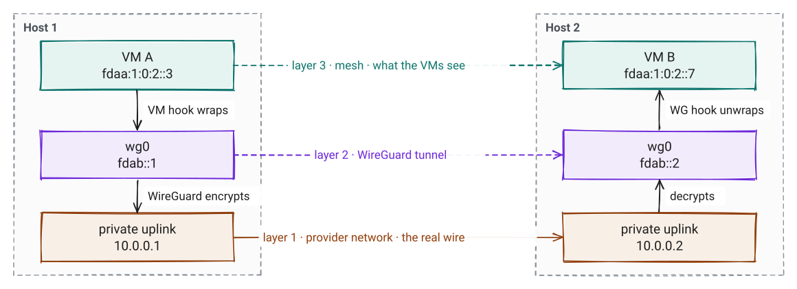

*Only the bottom line is a real wire. A VM never sees the other two layers.*

---

# The address carries the policy

```text
fdaa : region 16 : tenant 32 : VM ID 64      one per VM
fdab : host WireGuard address                one per host

fdaa:1:0:2::3   →   region 1 · tenant 2 · VM 3
```

- The hooks read the tenant bits directly. No lookup.
- A **privileged** VM is a tenant-0 VM that Atlas lists. It may reach every tenant.

---

<!-- _class: pause -->

# What runs on a host?

---

# Four hooks, one set of maps

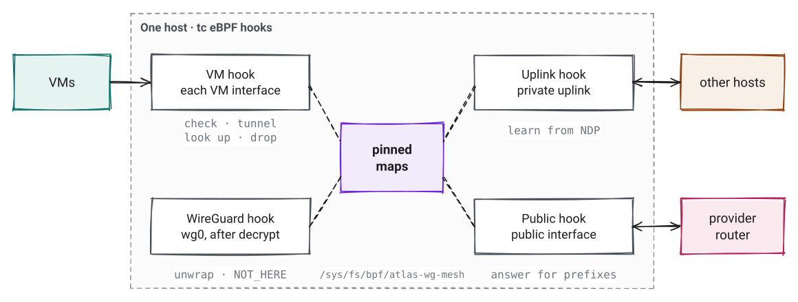

*`tc` eBPF programs from one object. No daemon. The `atlas-wg-mesh` CLI loads them and writes the maps.*

---

<!-- _class: small -->

# The maps that matter

| Map | Holds | Written by |
|---|---|---|
| `local_vms` | VM address → local interface | `vm sync` |
| `remote_vms` | VM address → host `fdab` address · LRU, 262,144 | uplink hook, from NDP |
| `peer_list` | peer IPv4, MAC, `fdab` address | `peers sync` |
| `privileged_vms` | tenant-0 addresses that reach every tenant | `privileged-vm replace` |
| `gateway_routes` | (VM, destination prefix) → gateway | `vm sync --route` |
| `owned_prefixes` · `moved_prefixes` | public prefix → owner, or new owner for 5 min | `vm sync --prefix` |

*No timers. A `remote_vms` entry lives until LRU eviction or a valid `NOT_HERE`.*

---

# The VM hook, in order

1. Drop anything sent to `fdab::/16`
2. Destination outside the mesh: send it to the VM's gateway
3. Drop a source address the VM does not own
4. Drop another tenant, unless one side is privileged
5. Same host: let Linux deliver
6. Known remote host: tunnel through WireGuard
7. Unknown: turn the packet into an NDP lookup

---

<!-- _class: pause -->

# Follow one packet

VM A on host 1 sends to VM B on host 2

---

<!-- _transition: fade 250ms -->

# Known host: check and wrap

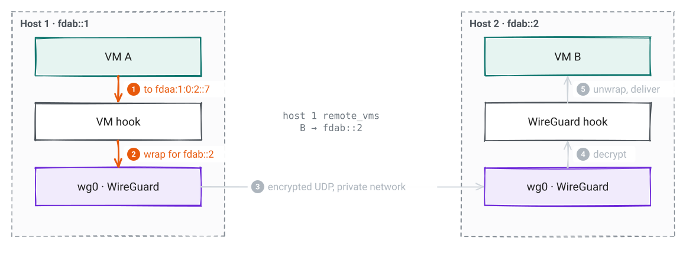

*Source owned by this interface, same tenant, host known. Next header 41 means IPv6 inside IPv6.*

---

<!-- _transition: fade 250ms -->

# Known host: WireGuard carries it


*Metal applies the WireGuard peers and keys from host sync.*

---

# Known host: unwrap and deliver

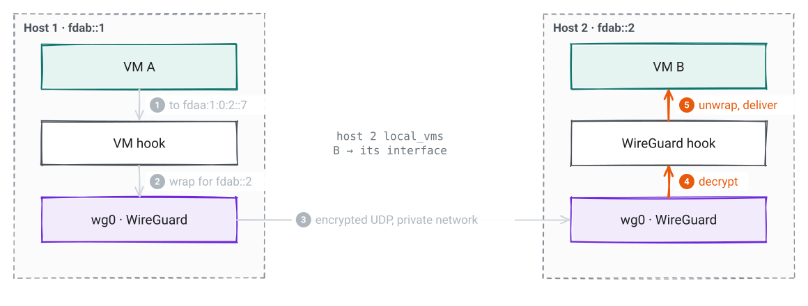

*The receiving host checks the tenant again. VM B sees the packet exactly as VM A sent it.*

---

# What is on the wire

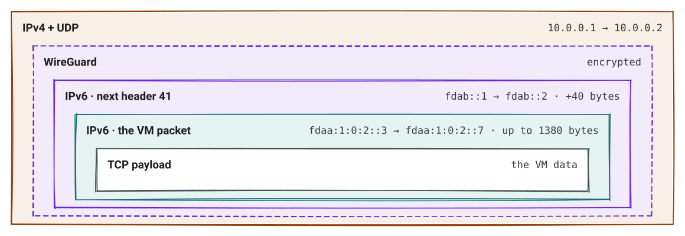

*VM MTU 1380 + 40-byte tunnel header = 1420, inside the 1440 of `wg0`.*

---

<!-- _class: pause -->

# What if host 1 has never seen VM B?

---

<!-- _transition: fade 250ms -->

# First contact: the packet becomes a question

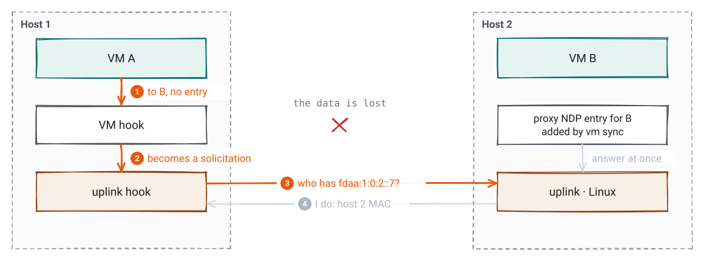

*Each VM interface may start 10 lookups a second, with a burst of 50.*

---

<!-- _transition: fade 250ms -->

# First contact: the owner answers


*`configure` sets `proxy_delay` to 0. Linux would otherwise wait up to 0.8 s before it answers.*

---

# First contact: remember the answer

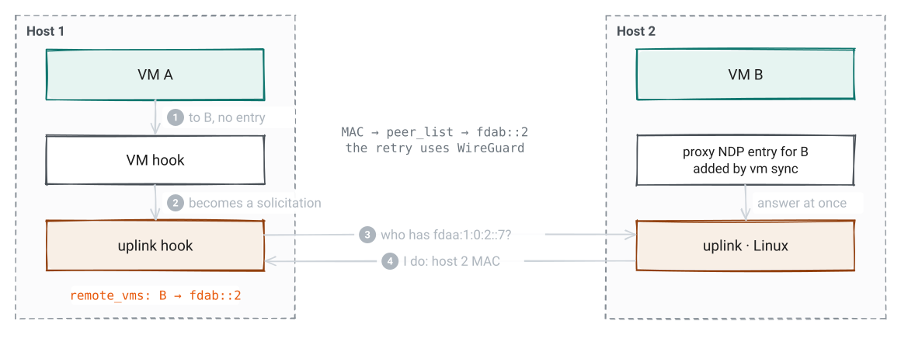

*One packet is lost. In a test, a new VM was reachable about 5 ms after `vm sync`.*

---

# When the network drops multicast

- `peers sync --unicast` attaches the uplink **egress** hook
- It wraps each NDP message in IPv4, protocol 41
- It sends one copy to each peer
- The receiver accepts wrapped NDP only from a peer address

*Only discovery changes. Throughput stays the same.*

---

<!-- _class: pause -->

# What if VM B moves?

---

<!-- _transition: fade 250ms -->

# VM moved: the sender still points at host 2

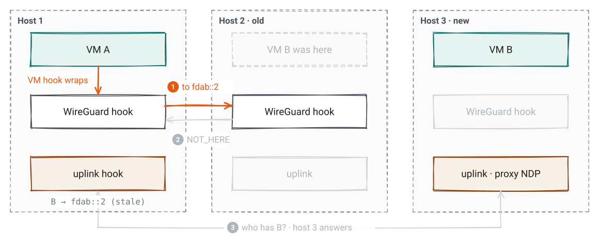

*The new host sent an unsolicited advertisement. Most hosts updated at once. Host 1 missed it.*

---

<!-- _transition: fade 250ms -->

# VM moved: host 2 says NOT_HERE


*`NOT_HERE` is IPv6 next header 253 with a 16-byte VM address. Only the stored host can clear an entry.*

---

# VM moved: ask again


*In a test, 15 moves took 1.5 ms to 10.5 ms, within one 10 ms ping.*

---

# Tenants stay apart

- The hook compares the 32-bit tenant fields of both addresses
- A different tenant is dropped, even on the same host
- A privileged tenant-0 VM passes both ways, so replies work
- Examples: HTTP proxy, Cargo, IPv6 router

---

<!-- _class: pause -->

# Traffic from outside the mesh

A public client reaches a tenant VM

---

# A gateway VM needs two flags

| Flag | Effect in WG Mesh |
|---|---|
| **Privileged** | In `privileged_vms`: passes the tenant check |
| **Network gateway** | In `gateways`: may send a source outside the mesh |

*The gateway's own software does NAT and firewalling. The mesh carries and checks.*

---

# A gateway route works both ways

```text
VM V:   2000::/3  via  fdaa:1::56      the IPv6 router
```

- **Out:** V's packets to public IPv6 go to the router
- **In:** an outside source reaches V only if V has a route back to it
- Key = V's address + destination: one trie holds a table per VM

*A public address that maps to a real VM gets nothing until Atlas adds the route.*

---

<!-- _transition: fade 250ms -->

# Public IPv6: in through the router


*The router changes only the destination. VM V sees the real client address.*

---

# Public IPv6: the reply

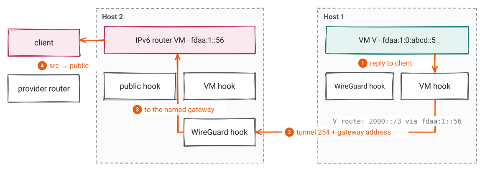

*Next header 254 names the gateway, because one host can run several.*

---

# The gateway tunnel fits

```text
outer IPv6   fdab::1 → fdab::2, next header 254           40 bytes
gateway      fdaa:1::56                                   16 bytes
client       fdaa:1:0:abcd::5 → 2001:db8:ffff::10      ≤ 1380 bytes
                                                       ≤ 1436 bytes
wg0 MTU                                                  1440 bytes
```

- The router maps addresses with bit arithmetic: no table, no connection state

---

<!-- _transition: fade 250ms -->

# The router moved: the old host forwards


*The provider caches host 2's MAC and does not ask again. So host 3 tells it.*

---

# The router moved: the provider learns

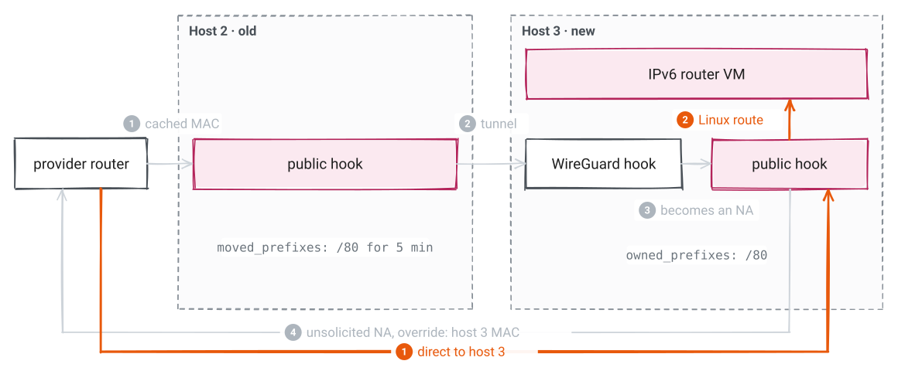

*One advertisement per address per second. The old host forwards for 5 minutes.*

---

<!-- _class: small -->

# Who owns what

| Part | Owns | Does not own |
|---|---|---|
| **Atlas app** | VM addresses, host peers and keys, privileged VMs, gateway routes | Where a VM runs |
| **Metal** | WireGuard peers on the host, VM namespace and links, calls to `atlas-wg-mesh` | Packet decisions |
| **WG Mesh** | Per-packet decisions and learned locations | Keys, peers, NAT, DNS, DHCP, guest firewalls |
| **Gateway VM** | Address translation, forwarding, firewall policy | Mesh delivery, the return-route check |

---

# Look at a host

```sh
atlas-wg-mesh status                        # interfaces, NDP mode, map counts
atlas-wg-mesh inspect fdaa:1:10:20::5       # local, learned host, or unknown
atlas-wg-mesh vm list --json

atlas-wg-mesh vm sync --interface vh-100001 \
  --address fdaa:1:10:20::5 --mtu 1380      # replaces all state of one VM
```

*Private fault? Check WireGuard peers, then the VM namespace, then `local_vms` and `remote_vms`.*

---

# Measured on two hosts

| Path | Throughput | Average ping |
|---|---:|---:|
| Raw private network | 939 Mbit/s | 0.28 ms |
| Host-to-host WireGuard | 886 Mbit/s | 0.76 ms |
| VM to VM, two hosts | 847 Mbit/s | 1.75 ms |
| VM to VM, one host | 14.3 Gbit/s | 0.92 ms |

*Scaleway bare metal, 1 GbE, Firecracker 2 vCPU. `iperf3` TCP, one stream, median of 3.*

---

# Limits

- The first packet to a new or moved VM can be lost. Clients retry.
- NDP trusts the private host network. It does not authenticate hosts by itself.
- The mesh covers one region. It does not connect regions.
- `NOT_HERE` (253) and the gateway tunnel (254) are Atlas formats, not standards.

---

<!-- _class: lead -->
<!-- _paginate: false -->

# Read more

[WG Mesh design](https://github.com/frappe/atlas/blob/develop/docs/networking/wg-mesh/index.md) · [How VMs reach each other](https://github.com/frappe/atlas/blob/develop/docs/networking/index.md) · [Gateway VMs](https://github.com/frappe/atlas/blob/develop/docs/networking/wg-mesh/gateways.md)

[vm.h](https://github.com/frappe/atlas/blob/develop/services/wg-mesh/bpf/vm.h) · [wireguard.h](https://github.com/frappe/atlas/blob/develop/services/wg-mesh/bpf/wireguard.h) · [uplink.h](https://github.com/frappe/atlas/blob/develop/services/wg-mesh/bpf/uplink.h) · [maps.h](https://github.com/frappe/atlas/blob/develop/services/wg-mesh/bpf/maps.h)

*frappe/atlas · all addresses are examples*
