<!-- _class: lead -->
<!-- _paginate: false -->

# WG Mesh

How an Atlas VM packet finds its host

*eBPF, WireGuard, and NDP inside one region*

---

<!-- _class: center -->

# One address per VM

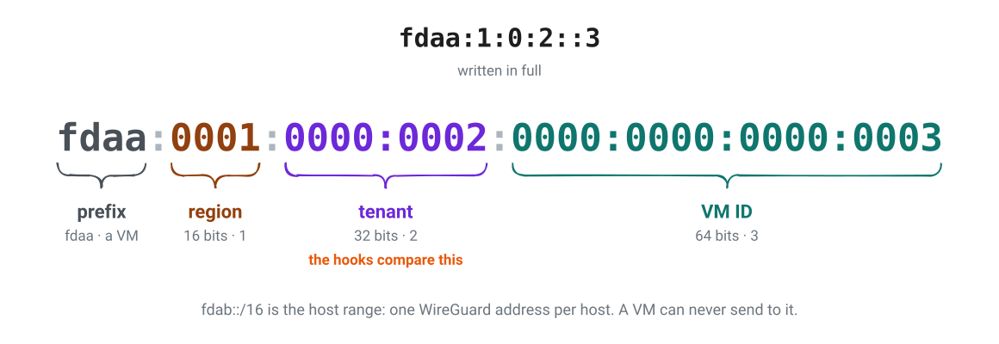

---

# A VM address names the VM, not the host

- Atlas picks a host when it creates a VM
- A migration keeps the address and changes the host
- Every other host must still find the VM before it can send to it

*WG Mesh does not keep a central map. A host that does not know asks the network, and the owner answers.*

---

# Four steps, each built on the last

1. **Normal VMs:** find a host, tunnel, repair after a move, keep tenants apart
2. **Privileged VMs:** tenant-0 services that may reach every tenant
3. **Gateway VMs:** carry traffic for addresses outside the mesh
4. **IPv6 router:** a gateway VM that gives each VM a public IPv6 address

---

<!-- header: '1 · Normal VMs' -->

# Three layers, one packet


*Watch the packet strip. An orange cell is the header that the last step added.*

---

# Four hooks, one set of maps


*`tc` eBPF programs from one object. No daemon. The `atlas-wg-mesh` CLI loads them and writes the maps.*

---

<!-- _class: small -->

# The maps a normal VM uses

| Map | Holds | Written by |
|---|---|---|
| `local_vms` | VM address → local interface | `vm sync` |
| `remote_vms` | VM address → host `fdab` address · LRU, 262,144 entries | uplink hook, from NDP |
| `peer_list` | peer IPv4, MAC, `fdab` address | `peers sync` |
| `discovery_limits` | lookup tokens per VM interface | VM hook |

*No timers. A `remote_vms` entry lives until LRU eviction or a valid `NOT_HERE`.*

---

# The VM hook, in order

1. Drop anything sent to `fdab::/16`
2. Drop a source address that the VM does not own
3. Drop another tenant
4. Same host: let Linux deliver
5. Known remote host: tunnel through WireGuard
6. Unknown host: turn the packet into an NDP lookup

*Privileged and gateway VMs add rules later. This order stays.*

---

# Same host: Linux delivers


*The packet does not change. In a test this path moved 14.3 Gbit/s.*

---

<!-- _transition: fade 250ms -->

# Known host: check and wrap


*Next header 41 means IPv6 inside IPv6. The outer addresses are the two hosts.*

---

<!-- _transition: fade 250ms -->

# Known host: WireGuard carries it


*Metal applies the WireGuard peers and keys. WG Mesh only picks the host.*

---

# Known host: unwrap and deliver


*The receiving host checks the tenant again. VM B sees the packet exactly as VM A sent it.*

---

<!-- _transition: fade 250ms -->

# First contact: the packet becomes a question


*Each VM interface may start 10 lookups a second, with a burst of 50.*

---

<!-- _transition: fade 250ms -->

# First contact: the owner answers


*`configure` sets `proxy_delay` to 0. Linux would otherwise wait up to 0.8 s.*

---

# First contact: remember the answer


*One packet is lost. In a test, a new VM was reachable about 5 ms after `vm sync`.*

---

# No multicast? Send a copy to each peer


*`peers sync --unicast` attaches the egress hook. Only discovery changes, not throughput.*

---

<!-- _transition: fade 250ms -->

# VM moved: the sender still points at host 2


*The new host sent an unsolicited advertisement. Most hosts updated at once. Host 1 missed it.*

---

<!-- _transition: fade 250ms -->

# VM moved: host 2 says NOT_HERE


*Only the host stored in `remote_vms` can clear an entry. Another host cannot erase a good one.*

---

# VM moved: ask again


*In a test, 15 moves took 1.5 ms to 10.5 ms, within one 10 ms ping.*

---

# Tenants stay apart


*The orange parts of the addresses are the tenant fields that the hook compares.*

---

<!-- header: '2 · Privileged VMs' -->
<!-- _class: pause -->

# Privileged VMs

Tenant-0 services that serve every tenant

---

# What makes a VM privileged

- It is a **tenant 0** VM, and Atlas lists it in `privileged_vms` during host sync
- The tenant rule passes when **either side** is privileged
- So a tenant VM can reply to a privileged VM
- Examples: HTTP proxy, Cargo, IPv6 router

*Only Atlas can grant privilege, and only to tenant-0 VMs.*

---

# A privileged VM crosses tenants


*Rule 3 becomes: drop another tenant, unless one side is privileged.*

---

<!-- header: '3 · Gateway VMs' -->
<!-- _class: pause -->

# Gateway VMs

Traffic for addresses outside the mesh

---

# A gateway VM needs two flags

| Flag | Effect in WG Mesh |
|---|---|
| **Privileged** | In `privileged_vms`: passes the tenant rule |
| **Network gateway** | In `gateways`: may send a source outside the mesh, and receives gateway tunnels |

*The gateway's own software forwards, translates, and filters. The mesh carries packets and checks two rules.*

---

# A gateway route works both ways

```text
VM V:   2000::/3  via  fdaa:1::56      the gateway VM
```

- **Out:** V's packets to that prefix go to the gateway
- **In:** an outside source reaches V only if V has a route back to it
- The key is V's address + the destination, so one trie holds a table per VM

*`vm sync --route 2000::/3=fdaa:1::56` writes it into `gateway_routes`.*

---

# The VM hook, with gateway rules

1. Drop anything sent to `fdab::/16`
2. **Outside destination: check the source, then send to the gateway route**
3. Drop a source that the VM does not own. **An outside source only from a gateway.**
4. Drop another tenant, unless one side is privileged
5. Same host: let Linux deliver. **An outside source needs a route back.**
6. Known remote host: tunnel through WireGuard
7. Unknown host: turn the packet into an NDP lookup

---

<!-- _transition: fade 250ms -->

# Out: the VM hook picks the gateway


*Next header 254 puts the gateway address first. The destination is outside the mesh, and one host can run several gateways.*

---

# Out: host 2 hands it to the named gateway


*If the gateway is not on host 2, host 2 replies `NOT_HERE` for the gateway address.*

---

<!-- _transition: fade 250ms -->

# In: only a gateway may send an outside source


*A normal VM that sends a source it does not own is dropped at rule 3.*

---

# In: the route back is the guard


*No route back, no delivery. So a VM receives outside traffic only through a gateway that it replies through.*

---

# The gateway tunnel fits the MTU

```text
outer IPv6   fdab::1 → fdab::2, next header 254          40 bytes
gateway      fdaa:1::56                                  16 bytes
VM packet    fdaa:1:0:abcd::5 → 2001:db8:ffff::10     ≤ 1380 bytes
                                                      ≤ 1436 bytes
wg0 MTU                                                 1440 bytes
```

---

<!-- header: '4 · IPv6 router' -->
<!-- _class: pause -->

# The IPv6 router

A gateway VM for public IPv6

---

# Why a router VM

- Some providers attach a whole IPv6 block to **one host**
- A VM that moves to another host cannot take the block with it
- So the block stays on a router VM, and each VM gets a derived `/128`
- The VM keeps its mesh and public addresses when it moves. WG Mesh finds its new host.

*The router is a privileged, network gateway VM. Everything from part 3 applies.*

---

<!-- _class: center -->

# The address bits carry the mapping


*No table and no connection state. A tenant of 2^24 or more, or a VM of 2^20 or more, gets no public address.*

---

<!-- _transition: fade 250ms -->

# In: the public packet reaches the router


*New in this part: the public hook and `owned_prefixes`.*

---

# In: the router changes only the destination


*Steps 5 and 6 are the gateway inbound path. VM V sees the real client address.*

---

# Out: the reply gets its public source back


*Steps 1 to 3 are the gateway outbound path. Step 4 is the router's own translation.*

---

<!-- _transition: fade 250ms -->

# The router moved: the old host forwards


*The provider caches host 2's MAC and does not ask again. So host 3 tells it, once a second at most.*

---

# The router moved: the provider learns


*The old host forwards for 5 minutes. The first packet can be lost.*

---

<!-- header: '' -->
<!-- _class: small -->

# Who owns what

| Part | Owns | Does not own |
|---|---|---|
| **Atlas app** | VM addresses, host peers and keys, privileged VMs, gateway routes | Where a VM runs |
| **Metal** | WireGuard peers on the host, VM namespace and links, calls to `atlas-wg-mesh` | Packet decisions |
| **WG Mesh** | Per-packet decisions and learned locations | Keys, peers, NAT, DNS, DHCP, guest firewalls |
| **Gateway VM** | Address translation, forwarding, firewall policy | Mesh delivery, the return-route check |

---

# Look at a host

```sh
atlas-wg-mesh status                        # interfaces, NDP mode, map counts
atlas-wg-mesh inspect fdaa:1:10:20::5       # local, learned host, or unknown
atlas-wg-mesh vm list --json

atlas-wg-mesh vm sync --interface vh-100001 \
  --address fdaa:1:10:20::5 --mtu 1380      # replaces all state of one VM
```

*Private fault? Check WireGuard peers, then the VM namespace, then `local_vms` and `remote_vms`.*

---

# Measured on two hosts

| Path | Throughput | Average ping |
|---|---:|---:|
| Raw private network | 939 Mbit/s | 0.28 ms |
| Host-to-host WireGuard | 886 Mbit/s | 0.76 ms |
| VM to VM, two hosts | 847 Mbit/s | 1.75 ms |
| VM to VM, one host | 14.3 Gbit/s | 0.92 ms |

*Scaleway bare metal, 1 GbE, Firecracker 2 vCPU. `iperf3` TCP, one stream, median of 3.*

---

# Limits

- The first packet to a new or moved VM can be lost. Clients retry.
- NDP trusts the private host network. It does not authenticate hosts by itself.
- The mesh covers one region. It does not connect regions.
- `NOT_HERE` (253) and the gateway tunnel (254) are Atlas formats, not standards.

---

<!-- _class: lead -->
<!-- _paginate: false -->

# Read more

[WG Mesh design](https://github.com/frappe/atlas/blob/develop/docs/networking/wg-mesh/index.md) · [How VMs reach each other](https://github.com/frappe/atlas/blob/develop/docs/networking/index.md) · [Gateway VMs](https://github.com/frappe/atlas/blob/develop/docs/networking/wg-mesh/gateways.md) · [IPv6 router](https://github.com/frappe/atlas/blob/develop/docs/networking/ipv6-router.md)

[vm.h](https://github.com/frappe/atlas/blob/develop/services/wg-mesh/bpf/vm.h) · [wireguard.h](https://github.com/frappe/atlas/blob/develop/services/wg-mesh/bpf/wireguard.h) · [uplink.h](https://github.com/frappe/atlas/blob/develop/services/wg-mesh/bpf/uplink.h) · [maps.h](https://github.com/frappe/atlas/blob/develop/services/wg-mesh/bpf/maps.h)

*frappe/atlas · all addresses are examples*
