<!-- _class: lead -->
<!-- _paginate: false -->


# mica

Disks that follow your VMs and containers

*A block device whose data lives in S3*

---

# A sandbox should start on any node

- **Copy the disk first?** 20 GiB at 100 Mbit/s: about 30 min
- **Network block storage?** A storage cluster, and every read is remote
- **But a boot reads little:** about 700 MB of a 20 GiB disk

---

# What we want

1. Attach on any node, at once
2. Download only what is read
3. Write at local SSD speed

---

# The idea

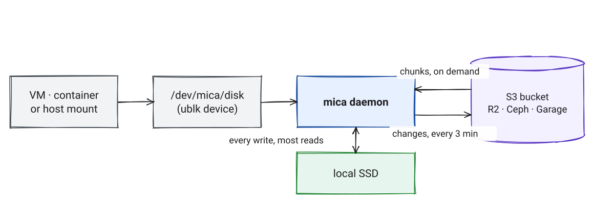

*S3 keeps the durable copy. The SSD makes it fast.*

---

# Three rules

1. **Writes land on the local SSD.** The guest never waits for S3.
2. **Reads go to S3 only on a miss.** Nothing is copied at attach.
3. **A checkpoint uploads changes** every 3 minutes, and at detach.

---

<!-- _class: pause -->

# How does a disk become objects?

---

# A disk is a row of 4 MiB chunks

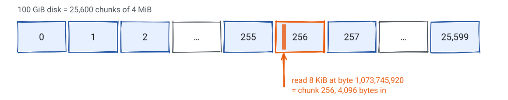

```text
chunk  = 1,073,745,920 / 4 MiB = 256
inside = 1,073,745,920 % 4 MiB = 4,096
```

---

# Each chunk is named by its SHA-256

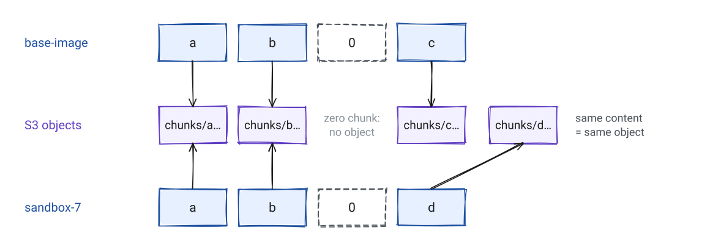

*Thin: zero chunks cost nothing. Deduplicated: equal chunks are stored once.*

---

# What is in S3

```text
chunks/<xx>/<sha256>      4 MiB of data             never changes
manifests/<sha256>        the full chunk list       never changes
disks/<disk>/head         the current manifest      one PUT per commit
disks/<disk>/attached     the owner node            only while attached
snapshots/<name>          a named manifest
```

- No conditional writes. R2, Ceph and Garage work the same.

---

<!-- _transition: fade 250ms -->

# A manifest is the whole disk

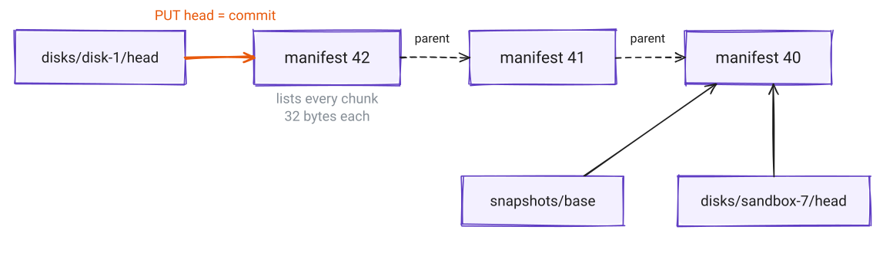

*800 KiB describes 100 GiB. One PUT of the head moves the disk to its next full state.*

---

# Snapshots and new disks copy nothing

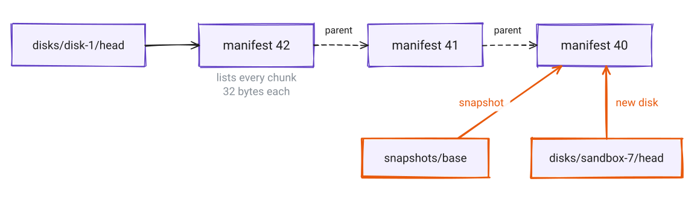

*Old manifests stay as restore points until GC.*

---

# What is on the local SSD

```text
/var/lib/mica/
  node-id                   random ID of this node
  cache/<xx>/<sha256>       clean chunks, all in S3
  disks/<disk>/
    state                   attached or orphaned, ublk device number
    dirty/<index>.chunk     changed by the guest
    dirty/<index>.frozen    being uploaded
    dirty/<index>.tmp       being made, deleted after a crash
```

- Only `dirty/` holds data S3 lacks. It is never deleted before a commit.
- The cache can lose any file at any time.

---

<!-- _class: pause -->

# What happens to one read and one write?

---

<!-- _transition: fade 250ms -->

# Read: the first match wins

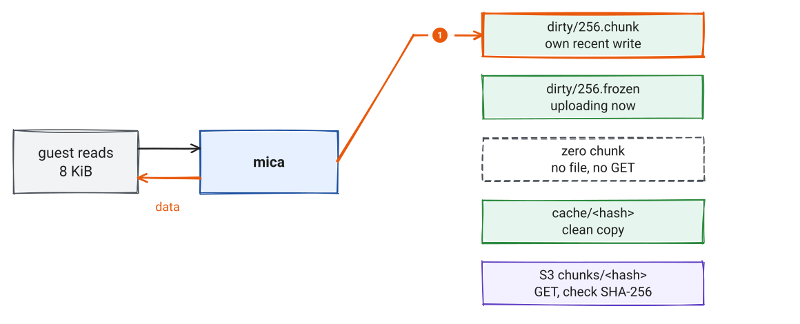

---

<!-- _transition: fade 250ms -->

# Read: the first match wins

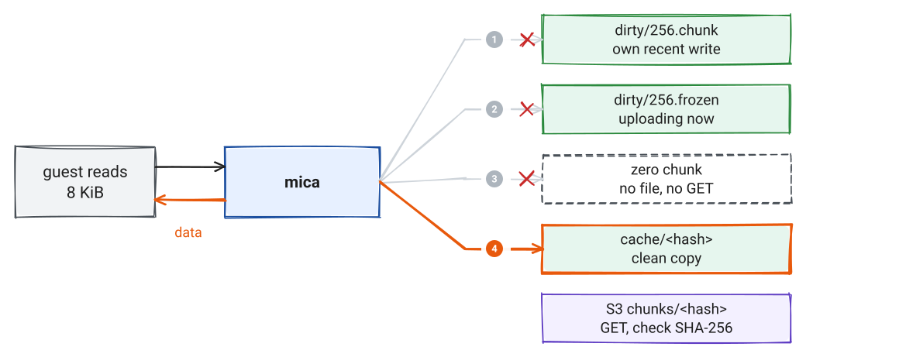

---

# Read: the first match wins

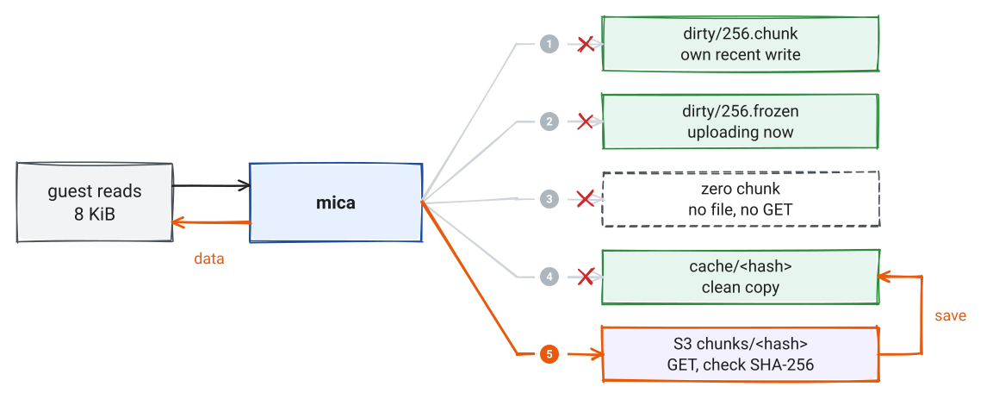

*Many misses on one chunk share one GET.*

---

<!-- _transition: fade 250ms -->

# Write: the first write to a chunk

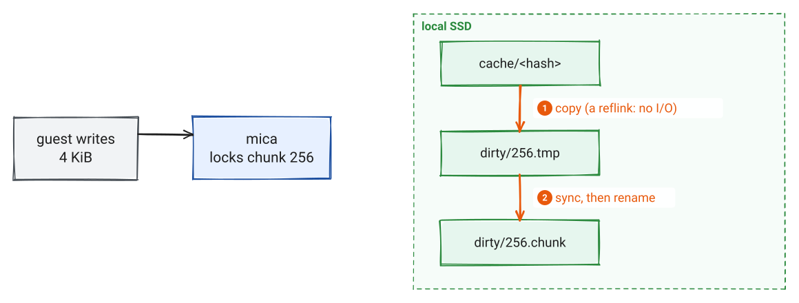

---

<!-- _transition: fade 250ms -->

# Write: the data

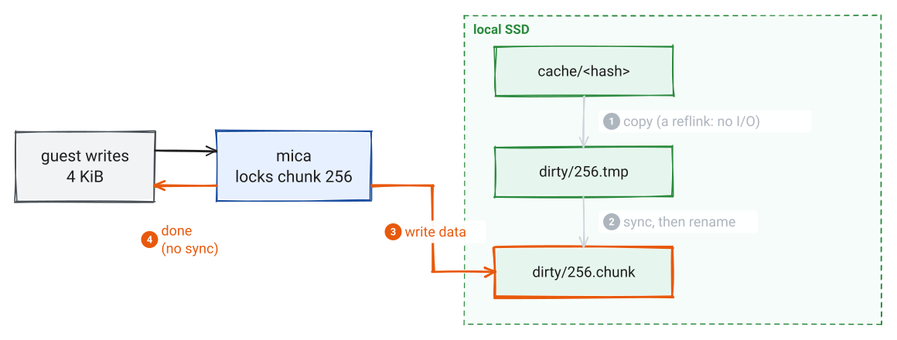

---

# Next writes to this chunk skip 1 and 2

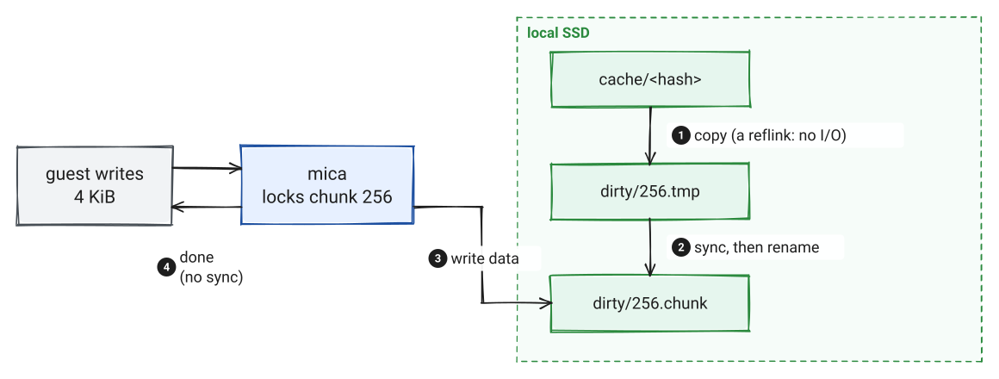

*A crash never leaves a half-copied chunk. The lock holds until the data is in the file.*

---

# Most requests stay on the queue thread

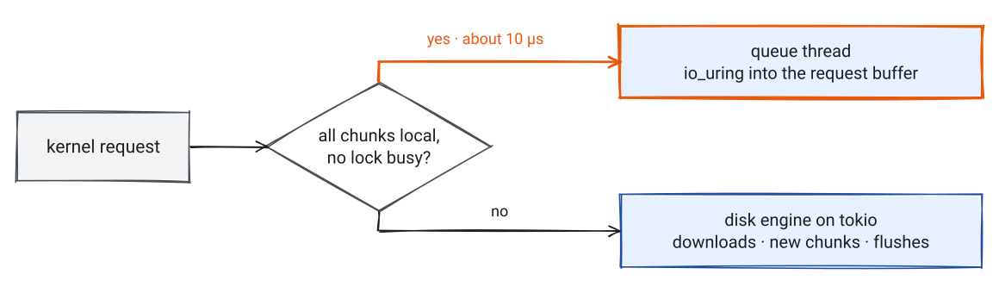

*No thread hop, no copy. Up to 4 queue threads per disk.*

---

# A flush never touches S3

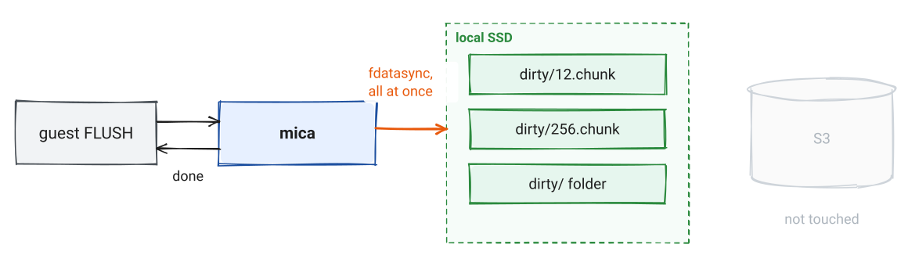

*A failed sync stops the disk: Linux may drop unsynced pages, so a retry proves nothing.*

---

<!-- _transition: fade 250ms -->

# Checkpoint: freeze

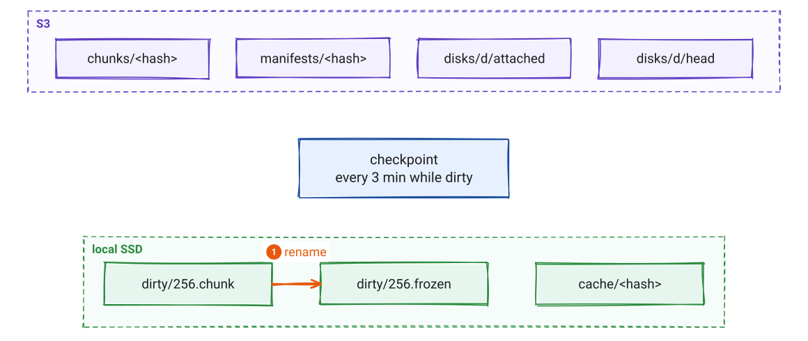

---

<!-- _transition: fade 250ms -->

# Checkpoint: upload

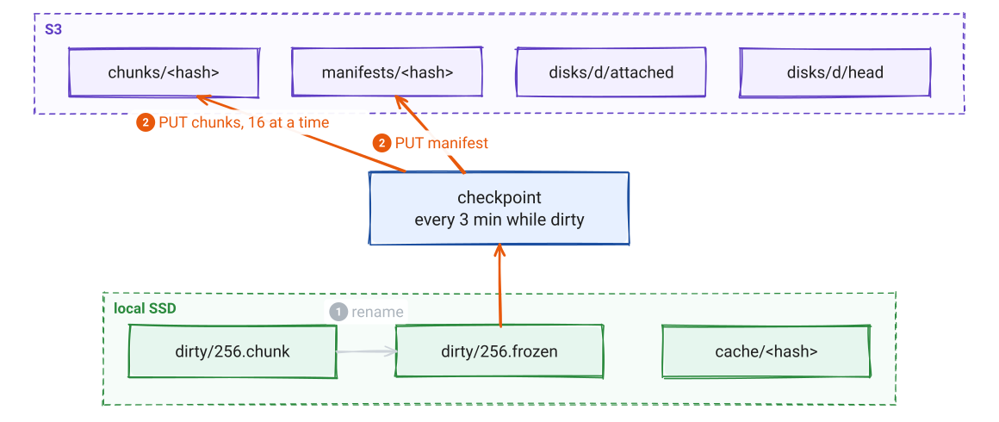

---

<!-- _transition: fade 250ms -->

# Checkpoint: commit

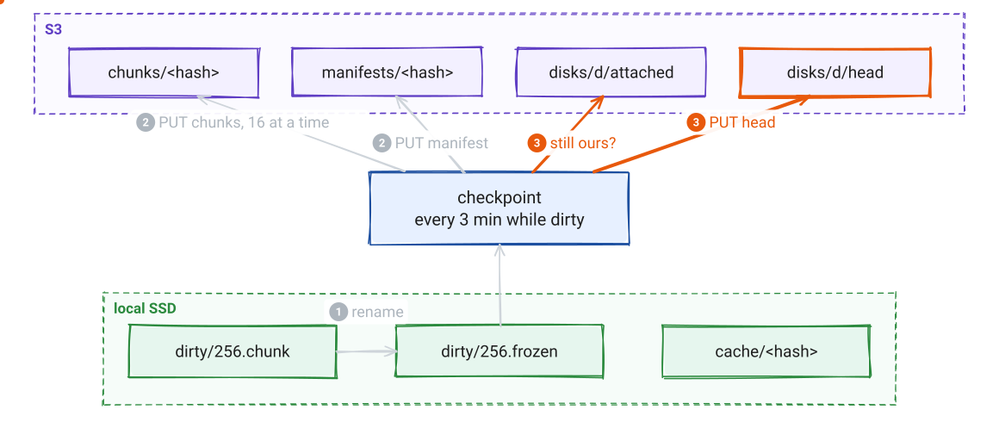

---

<!-- _transition: fade 250ms -->

# Checkpoint: repair and clean up

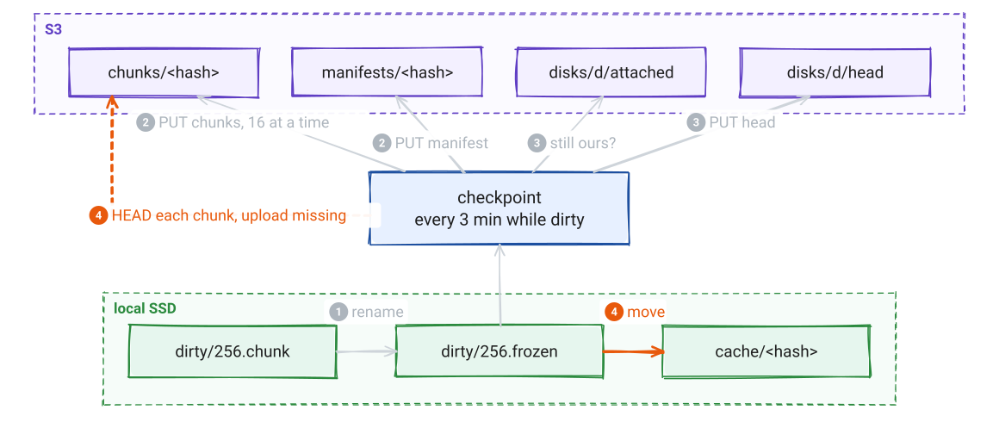

---

# Checkpoint

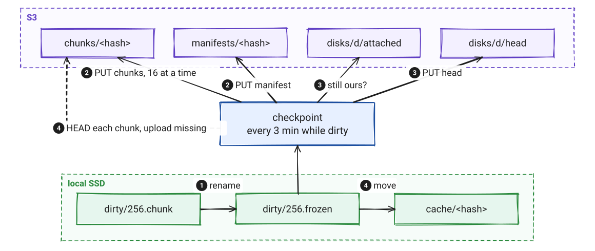

*Only while dirty. An idle disk makes no requests.*

---

<!-- _transition: fade 250ms -->

# Moving a disk: node A lets go

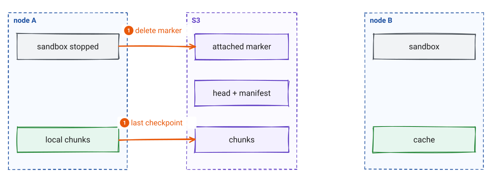

---

<!-- _transition: fade 250ms -->

# Moving a disk: node B claims it

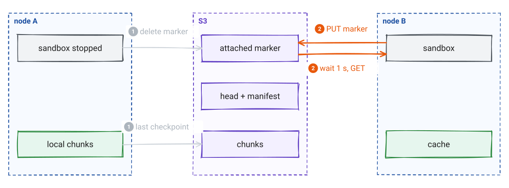

---

<!-- _transition: fade 250ms -->

# Moving a disk: node B starts

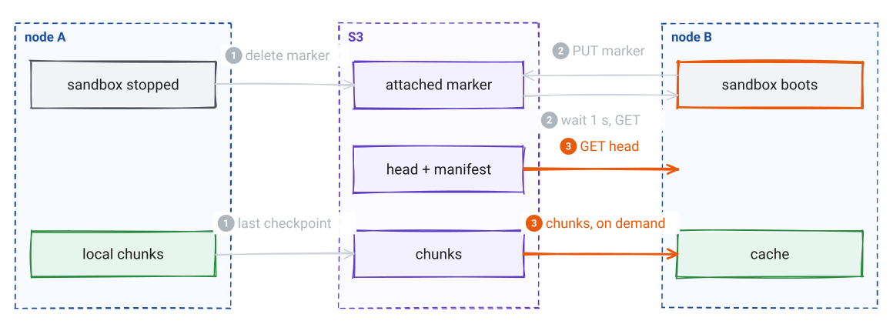

---

# Moving a disk

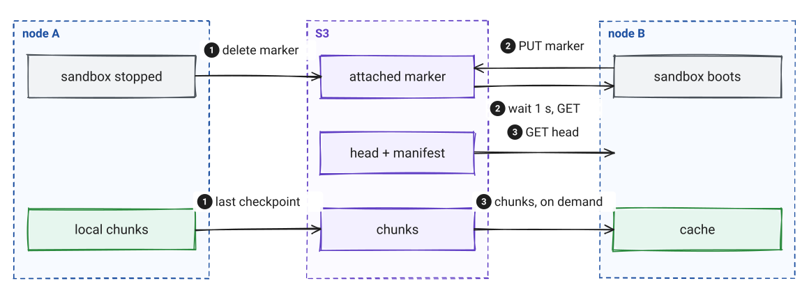

*Unmount returns only when S3 has everything. A 100 GiB disk attaches with two GETs.*

---

<!-- _class: pause -->

# What can go wrong?

---

# What mica promises

1. **Flushed data survives** a mica crash or a node reboot.
2. **While uploads keep up,** S3 is at most about 5 minutes behind.
3. **After a detach,** S3 has everything.
4. **Local data S3 lacks** is never deleted.
5. **Corrupt chunks** are never served: every download is hashed.
6. **A second writer** is detected, not prevented.

*On a slow link the disk shows as behind. `wait_when_behind` makes writes wait instead.*

---

# When something fails

| Failure | What happens | Data lost |
|---|---|---|
| mica crashes or restarts | Kernel holds I/O, new daemon takes over | None |
| Node reboots | Local chunks upload at boot | Unflushed writes |
| Node lost for good | Another node attaches with `--force` | About 5 min |
| S3 down or slow | Writes continue on the SSD, checkpoints retry | None |
| Disk taken by another node | The old node stops within a minute | Its unsaved writes, kept locally |
| Local `fsync` fails | The disk stops and keeps its data | The guest sees an error |
| GC deletes a chunk mid-commit | The checkpoint uploads it again | None |

---

<!-- _transition: fade 250ms -->

# One owner without conditional writes

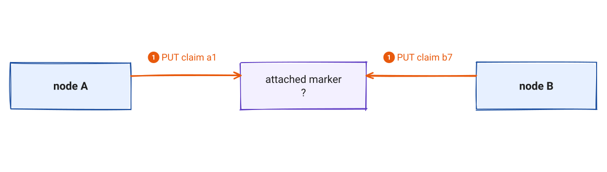

*Garage ignores `If-Match`. Ceph support varies. So mica needs neither.*

---

# One owner without conditional writes

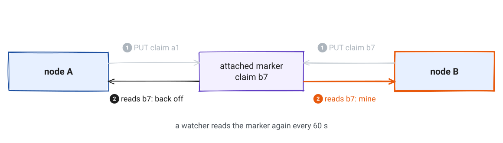

*Full manifests make any leftover race harmless: a head always names one full disk.*

---

<!-- _transition: fade 250ms -->

# GC can race a checkpoint

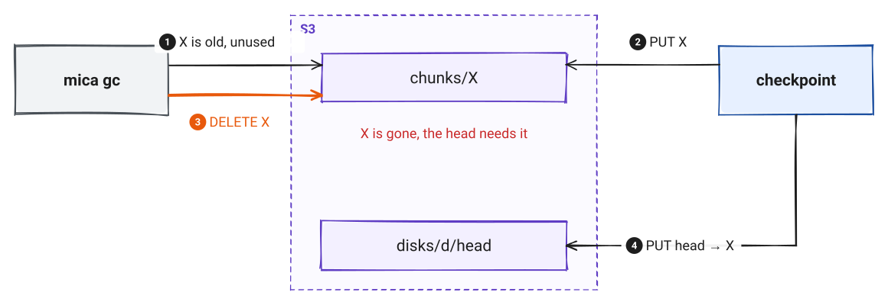

---

# The checkpoint repairs it

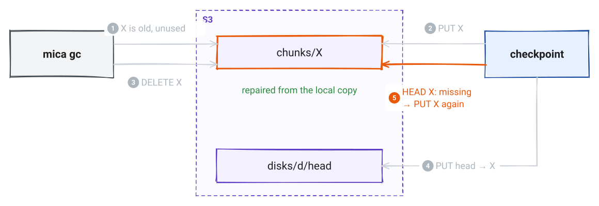

*GC also skips objects younger than 24 h, and stops if it cannot read every root.*

---

# Upgrades without downtime

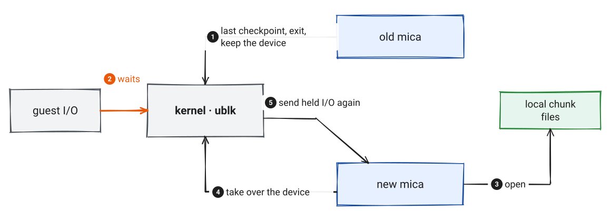

*Tested: a writer ran through `mica service restart`. Longest pause 0.8 s, no errors.*

---

<!-- _class: pause -->

# How fast, and what does it cost?

---

# Local I/O

| Test | Plain NVMe | mica |
|---|---|---|
| Sequential write, 1 MiB | 836 MiB/s | 535 MiB/s |
| Sequential read from cached chunks, 1 MiB | 2008 MiB/s | 1603 MiB/s |
| Random read 4K, depth 1 | 15k IOPS · 64 µs | **83k IOPS · 10 µs** |
| Random read 4K, depth 8 | 126k IOPS | **283k IOPS** |
| Random write 4K, depth 1 | 28k IOPS | **52k IOPS** |
| Random write 4K, depth 8 | 112k IOPS | 67k IOPS |
| 4K write + `fdatasync` | 970/s | 917/s |

*`O_DIRECT` in the guest, one laptop NVMe with btrfs. Small test data stays in the host page cache, so warm reads beat the raw drive.*

---

# Cold boot: the network decides

An Ubuntu 24.04 boot in Firecracker, cold cache: **173 chunks, 692 MiB**

| Download speed | Time |
|---|---|
| 2.2 MB/s, the test link | about 5.5 min |
| 50 MB/s, a server link | about 14 s |
| 110 MB/s, 1 Gbit/s | about 6 s |
| Warm node, no downloads | root mounted at 0.8 s |

*Keep base images warm with `mica disk warm`. 4 MiB chunks make scattered reads costly.*

---

# Cost on Cloudflare R2

| Action | Requests | Cost |
|---|---|---|
| Idle attached disk | none | $0 |
| Write 1 GiB of new data | 256 PUT | $0.0012 |
| Stop and start a sandbox | ~6 PUT, ~90 GET | $0.00006 |
| A disk busy all day, every day | ~144k PUT a month | ~$0.65 a month |
| 1 TB stored | – | ~$15 a month |

*Storage dominates. Disks from one image share its chunks.*

---

<!-- _class: pause -->

# How do you use it?

---

# The CLI

```text
mica status
mica disk      ls  create  warm  attach  mount  unmount  detach  resize  delete
mica snapshot  ls  create  delete
mica gc
mica cache     status  prune
mica service   setup  start  stop  restart  status  logs
```

```bash
mica disk create sandbox-7 --from-snapshot base-image
mica disk attach sandbox-7 --prefetch 32
mica disk mount data-1 /srv/data --owner www-data
mica disk unmount data-1        # returns when S3 has everything
```

---

# Running a node

- `mica service setup` tests the bucket and installs `mica.service`
- Mounts are `mica-mount@<disk>` units: back after reboot, uploaded at shutdown
- The `mica` group works without sudo; mounts stay in `/mnt`, `/srv`, `/media`
- Upgrade = setup again. Attached disks keep running.

---

# What is next

- Read-ahead for cold sequential reads
- Smaller chunks for boot disks, measured on the same image
- Parallel writes on the queue thread: depth 8 fell from 195k to 67k IOPS
- Automated tests for the engine, checkpoints and crash recovery
- vhost-user-blk as a second frontend for VMs

---

<!-- _class: lead -->
<!-- _paginate: false -->


# mica

Local SSD speed, S3 durability, disks that move

*github.com/tanmoysrt/mica*
